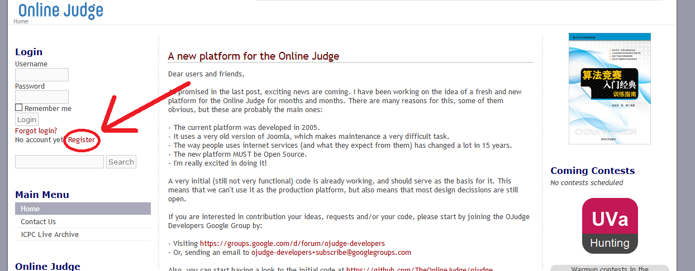
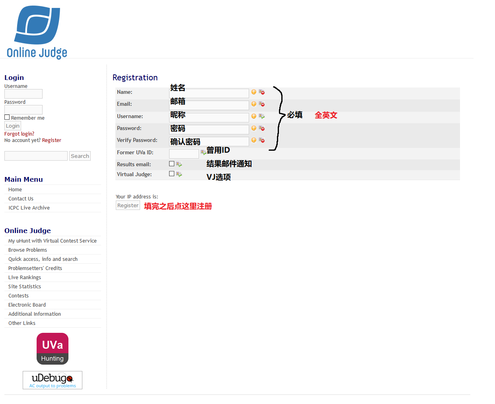
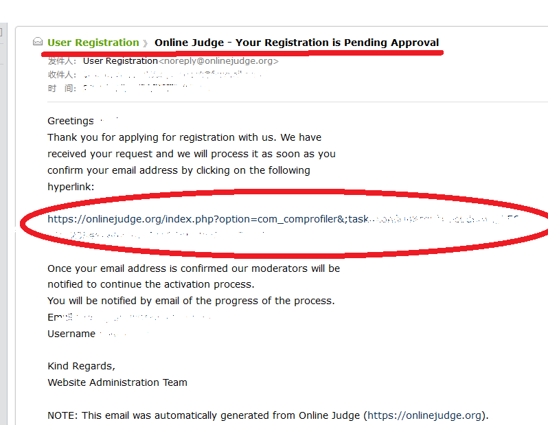
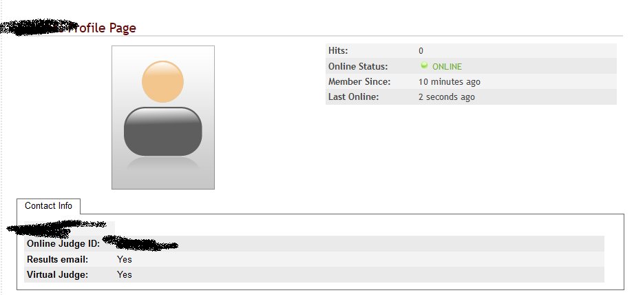
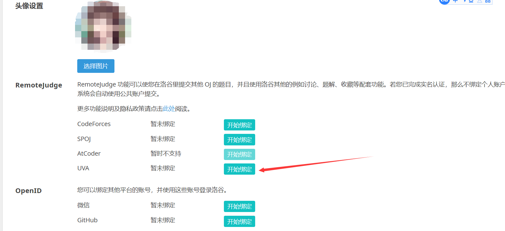
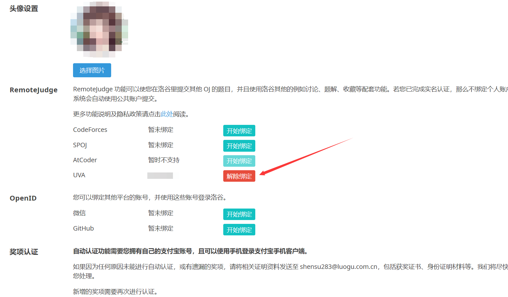

# UVa 账号绑定指南

## 进入UVa

https://onlinejudge.org/

可能有点卡，但不需要梯子。

## 进入注册页面

密码要求：无空格，至少6位，包含数字或大小写字母，支持符号

Result Email和Virtual Judge都打赏勾，然后点击Register注册即可，注册成功会收到邮件

## 确认邮件

进入自己的邮箱，找到UVa的确认链接，点进去

找不到链接去垃圾箱里找找

## 登录UVa账号

确保你已经完全注册成功

## 登录洛谷

鼠标移动到头像上，点击个人设置
Remote Judge绑定UVA

按提示输入即可

## 完成，做作业吧