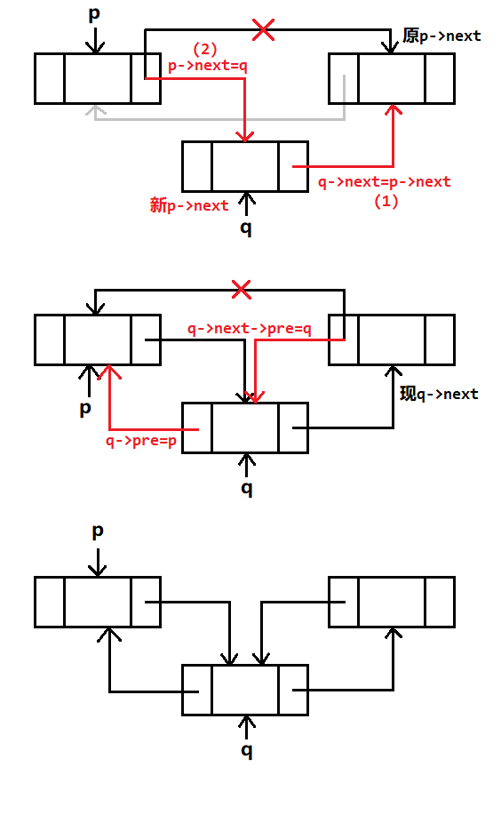
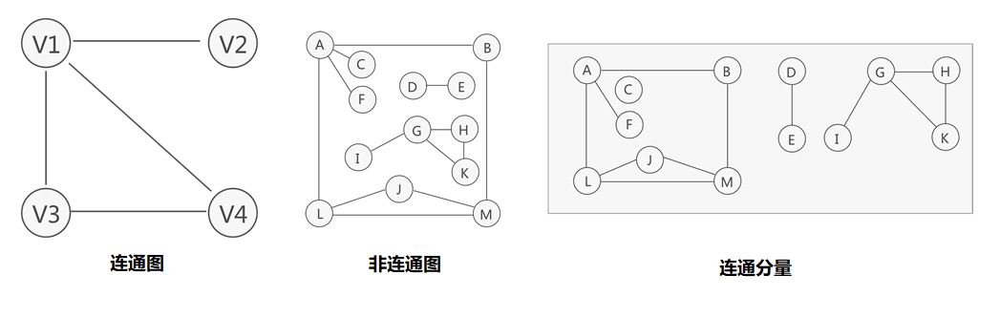
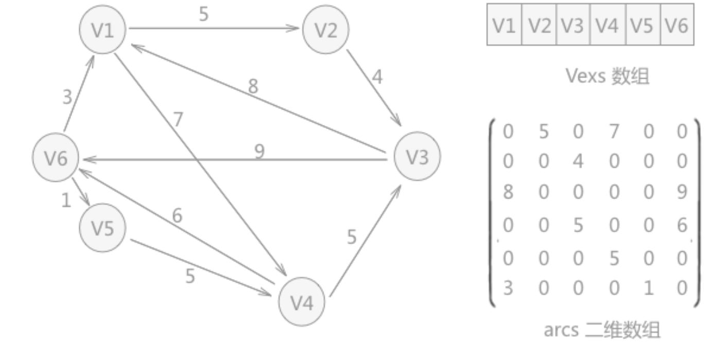

# 初赛资料与真题模拟 II

## 1 前言与目录


   《初赛资料与真题模拟II》主要将介绍初赛中可能涉及到的数据结构、算法、数学等相关知识，并且每个专题会有配套的训练题。结合《初赛资料与真题模拟I》，系统、全面讲解初赛。内部资料，请勿外传泄露。
	
   数据结构部分，主要包括线性表，树，图这几方面的内容。主要考察对相关概念的理解与对应基础操作（增删查改遍历）。此部分占分10到15分，在选择题中出现可能性较大。偶尔会出现在问题求解（1题5分）。
	
   算法部分，主要包括模拟，字符串处理，简单数论，递归回溯等方面的内容。同时数据结构相关的算法如树的遍历，最短路等也会被归纳到本部分。算法在初赛中是重点，占比60~70分。在读程序写结果与程序填空部分出现，这二者都是考试的重头戏，需要特别注意。
	
   数学部分，主要包括离散数学，线性代数等部分基础内容。主要考察集合运算，逻辑运算与排列组合问题，在选择题与问题求解中出现可能性较大，一般占比10~15分。该部分需要大量的练习才可以提升熟练度。
	
   其他部分，一般考察计算机其他方面的常识，主要是考察学生对计算机相关知识面的广阔程度。一般有计算机组成原理、操作系统、网络等方面的知识点考察。这部分主要靠日常的积累，当然在《初赛资料与真题模拟I》也有较为详细的介绍，可作临时突击用。一般占比5分。
	
   初赛是OI系列比赛的第一道坎。路一步一步走，脚踏实地，就能获得成功。预祝同学们获得好成绩。

<p align="right">Wonyeaweat 2020.09.03</p>

<div STYLE="page-break-after: always;"></div>
[TOC]
<div STYLE="page-break-after: always;"></div>

## 2 数据结构

### 2.1 线性表

+ **线性表，全称“线性存储结构”。**

线性表，顾名思义，是“线性”的。可以简单地理解成“数据们被**排成一行**”。在线性表里，有明确的“第一个”与“最后一个”。想象有一根细线，线上串满了宝珠——代表着一个个数字。这是最直观也是最容易理解的数据存储方式。

+ **物理存储方式**

物理存储方式指的是数据在真实的存储介质中的存储方式。在逻辑上的存储方式与在物理上的存储方式是两个概念。在逻辑上连续的数据，在实际存储中可能是不连续的。只不过是由于那根**看不见的“线”**，让数据看起来逻辑有序。


想象一下，在上图的”分散存放方式“中，我们将绳子两端拉起，是不是就和左边一样了呢？

分散存储是值得肯定的。假设你是一个快递站管理员，专门看管快递，时不时的有新快递，也时不时会来人取走快递。如果采用顺序方式存储，（比如按快递到站顺序摆放）很可能会出现**找不到一块足够大的空间**。

一开始快递摆的满满当当，存放了很多。这时一些小件快递被取走，空出来一些空间。这时候来了一个**超大件**快递，很可能就没地方摆放了。但把那些分散在仓库的各个角落的零碎小空间**加起来**，很可能是够摆放这个超大件快递的哦！这样就导致大量的碎片空间浪费。本来仓库是很大的，但最终发现存不了几个货物就没地方了。

一个可行的解决方法是：每次存放新货物时都**重新整理仓库**，把货物们**紧凑摆放**，这样空闲空间就集中起来，存放新的货物，也能保证顺序摆放。这种方式也被称为”碎片整理“。但代价是比较累，造成效率低下。

如果采用分散存放，问题就迎刃而解。这时候就需要我们有一个万能的分割机与融合机。每拿到一个新快递，就尝试存放进仓库，如果有空间就放，没空间，就用分割机将其分割成能塞进碎片空间的一块块，这样就**不需要”重新整理“**了。取出来使用融合机，将粉碎成一块块的再融合起来交给用户即可。这样能保证仓库里**绝对不会有空间浪费**。

现实生活里，我们没有分割机与融合机，但在计算机数据中，这是可以随意分割的。只要保证最后呈献给用户的是连续完整的数据，就可以。

#### 2.1.1 顺序表与数组

+ **顺序表，全名顺序存储结构**

是线性表的一种。顺序表对数据的物理存储结构也有要求。顺序表存储数据时，会提前申请一整块足够大小的物理空间，然后将数据依次存储起来，存储时做到数据元素之间不留一丝缝隙。

从表现上看，它很像数组。一般在数据结构理论中，我们称之为**顺序表**。但如果是考虑到实际的代码实现，这时用到的叫**数组**。可以说，这二者是不同领域的相似概念。有一点需要注意的是，数组也可以实现其他的数据结构，如栈，队列，树，图等。数组的功能很强大，它可以**实现**顺序表，但不**是**顺序表。

+ **顺序表在逻辑上是连续的，在实际物理存储中也是连续的**。

这也是使用数组实现顺序表的原因之一。数组在内存中是连续的，这符合顺序表对物理存储的要求。正因连续，所以可以直接通过下标方式访问。下标本质上是地址的重新计算。对于一个数组而言，知道它的首地址（第一个元素所在内存空间的位置编号），那么通过下标即可推算出对应的地址。因此，数组也要求**数组中的元素必须是同类型**。（这样每个元素占用的空间数量是相等的，可以方便计算）。


内存地址就是一个整数编号，代表第多少个**字节（Byte）**。而这个编号一般很大，用二进制表示位数会太多太多，不方便查看。用十六进制表示就很短，方便查看处理。而一个int类型的数据，占用4个Byte，（4Byte=32bit=32个0或1，所以int所能表示的数据在2^31)所以一个**int数组的相邻的两个元素，地址值相差4.**

+ **增删查改**
	+ 查询与删除：对于顺序表而言，它的查询与修改都十分简单。即数组对应的下标访问与下标赋值。值得注意的是它的增加与删除操作。
	+ 增加元素：假设想对顺序表中**第i个元素后**插入一个新元素。可简单理解成，插入一个新数据到数组`arr[i]`。很明显，将原先的`arr[i]`及之后的所有元素**整体后移**，就可以腾出空间。当然，在实际代码实现时，**移动操作需要从后往前**。因为先移动前面的数据会覆盖掉后面尚未移动的数据，从后往前就能避免这种情况。如下图，移动顺序是5-4-3，而不是3-4-5。

	

	+ 删除元素：删除和增加其实是类似的。假设删除顺序表中的第i个元素，可将`arr[i]`之后的元素**整体前移**即可。注意，此时的**移动操作需要从前往后**，原因与上文一样：从后往前会覆盖掉前面尚未移动的数据。如下图，移动的是4-5.

	
	
+ **顺序表与vector**

顺序表可以使用数组实现，但不能满足其扩容需求，使用`vector`较为理想。`vector`底层也是连续的线性内存空间。通过观察`vector`底层源码可见其有三个指针，`_Myfirst`,`_Mylast`,`_Myend;`.

其中，`_Myfirst` 指向的是 `vector` 容器对象的**起始**字节位置；`_Mylast` 指向当前最后一个元素的**末尾**字节；`_Myend` 指向整个 vector 容器所占用内存空间的**末尾**字节。

```C++
//_Alloc 表示内存分配器，此参数几乎不需要我们关心
template <class _Ty, class _Alloc = allocator<_Ty>>
class vector{
    ...
protected:
    pointer _Myfirst;
    pointer _Mylast;
    pointer _Myend;
};

```


通过这 3 个迭代器，就可以表示出一个已容纳 2 个元素，容量为 5 的 vector 容器。如上图表示。

关于`vector`的各项操作，这里不在赘述。值得补充的是，`vector`可以”扩容“。这也是为何很多人称之为”弹性数组“。若存储已满，在新增数据的时候，就要分配一块更大的内存，将原来的数据**复制**过来，**释放**之前的内存，再插入新增的元素；

不同的编译器实现的扩容方式不一样，VS以1.5倍扩容，GCC以2倍扩容。这样是为了让后续新增数据有足够的空间。参照下面的这个例子：

```C++
#include<iostream>
#include<vector>
using namespace std;
int main(){
    vector<int> vec;
    cout << "Initial capacity: "<<vec.capacity() << endl;
    for (int i = 0; i<10; ++i){
        vec.push_back(i);
        cout << "size: " << vec.size() << " capacity: " << vec.capacity() << endl;
    }
    return 0;
}
```


因此在使用vector时要注意扩容问题，以防无节制的2倍扩容导致的MLE问题。

#### 2.1.2 单链表

**链表**，别名链式存储结构。“链表”在无特殊情况下指代的是**单链表**。

+ **链表不限制数据的物理存储状态**

这与顺序表不同。顺序表中对于某个元素而言，其前驱与后继都可以明确知道其位置。而对于链表而言，这是无法确定的。换句话说，使用链表存储的数据元素，其物理存储位置是**随机**的。因此，需要“细线”将数据串联。一个简单的解决方法是：为每一个数据项再搭配一个**指针**，指向下一个数据所在的位置。（即指向直接后继）

+ **链表的结点结构**


每一个链表结点包含两部分，分别是**数据域**与**指针域**。节点通常用结构体来实现。

```c++
struct node{
	int data; //代表数据域
	struct node *next; //代表指针域，指向直接后继元素
}
```

注意到`next`是**约定俗成**的后继指针名。**如非必要，不要随意更改**。由于后继也是一个结点，而非一个单独的数据，所以指针的类型是node类型。最后一个结点的指针指向空，即NULL。

+ **头结点，头指针和首元结点**

如同旅游一样，我们可以顺着next的指针一路走下去，访问链表上的各个结点。但选择哪一个结点开始作为旅途的起点呢？

1. **头结点**：我们可以人为添加一个“头结点”，它不保存任何实际有意义的数据，单纯作为起点。它的next指向的是首元结点。引入头结点是为了方便处理。值得注意的是：头结点不是必需。习题中的链表一般是不设头结点的。

2. **头指针**：一般头指针名字是`head`或`H`。它指向链表里的**第一个结点**。如果这个链表有头结点，则指向的是头结点。如果没有头结点，则指向的是首元结点。

3. **尾指针**：一般尾指针名字是`tail`
3. **首元结点**：链表中第一个存放了实际数据的结点。其他存放数据的结点被称为“其他结点”。注意：首元结点只是一个特殊称谓，它和其他结点并没有本质上的区别。


+ **链表的创立**

```C++
// 例：读入n个整数，建立单链表 

node* init() {
	node* head = NULL;//创建头指针
	node* tail = NULL;//创建尾指针 一开始链表为空，故head=tail=NULL
	
	head = (node*) malloc (sizeof(node)); // 创建一个头结点，头指针指向该结点 
	head -> next = NULL;
	tail = head; // 一开始只有头结点，故尾指针也指向头结点
	 
	for (i = 1; i <= n ; i++) {
		node* a = (node*)malloc(sizeof(node));//创建新结点
		scanf("%d",&a->data); a->next = NULL; //读入数据	
		tail->next = a; //a结点插在链表末尾，即tail结点的下一个 
		tail = tail->next; //指针tail每次都指向新链表的最后一个结点。当前是 a节点，故写tail=a也可 
	}
	
	return head;	//返回头指针head即可，通过头指针即可找到整个链表
}
	
```

+ **malloc 函数**

在上面的程序段里出现了`malloc`函数。`malloc`的全称是**memory allocation**，中文叫动态内存分配，用于申请一块连续的指定大小的内存块区域，以 **void * 类型 ** 返回分配的内存区域地址。

因此，在创建新结点时，必须先向内存申请一块空间，用于存放新结点。直接在for循环中声明一个node变量，它的生存周期只有一次循环（也就是所谓的局部变量）。它占用的空间会随着生存周期的结束而被释放。保存在里面的数据也因此丢失。通过malloc申请之后的空间需要通过free释放。这是不符合我们的要求的。因此**链表结点不能通过局部变量的形式构建**。

注意到malloc的函数原型：`void* malloc(unsigned int size)`，这说明它需要一个输入值，非负整数，表示申请的空间大小，即多少字节。因此这里可使用**sizeof**函数，先求出一个结点所占用的字节数，再将这个值传入malloc函数，即可申请到一块大小正好的内存空间用于存放新结点。

malloc函数的返回值是`void *` ，因此必须强制转换成`node *` 才能正确读写存放在对应位置的数据。所以代码中有 `(node *) malloc (sizeof (node))`。

+ **链表的操作**
+ **增·插入结点** 

**设要在结点p之后插入结点q**。这里体现了头结点的好处：如果想在一个链表的最前端插入新结点，等价于在头结点之后插入新结点，这样与在其他地方插入的操作是相同的。如果没有头结点，这个操作需要特殊处理。

明显的，我们要将q结点插入到p之后，**p->next**之前。一共有两个域需要改变：p的指针域应该指向q，而不是原先的p的后继。q的指针域应该指向原先p的后继。也即一共需要两步操作。关键问题在于这两步谁先谁后。

注意到链表结点在物理存储中不一定是连续的。所以如果先令`p->next=q;`则会**导致链表在p之后的全部结点丢失**。因为原来的p的下一个结点的地址被p->next所保存，更改了之后这个地址丢失，再也无从寻找。

**所以，先令`q->next = p->next;`，这样原来的p的下一个结点的地址被p->next所保存，也被q->next所保存。此时再更改p的指针域就不用担心丢失问题。**结合下图，思考：如果真的不慎将二者操作顺序颠倒，除了导致后续结点丢失，还会产生什么问题？


+ **遍历链表**

链表需要从头（头指针 或 头结点）开始依次向后遍历。使用一个迭代指针now，在链表上不断向后移动。如果为NULL，则停止。注意：**一个值为NULL的指针（空指针）不能有任何读写操作，否则会直接异常报错。**这是无法通过编译查出的错误。一定要先判断指针是否为空，才能进行下一步的操作。此类错误极其隐蔽，需要特别注意。

```C++

void output(node* head){
	node* now = head;
	while(now != NULL){
		cout<< now->data<<" -> ";
		now = now->next;
	}
}
```

+ **删除结点**

**删除结点p**

删除p结点，意味着p的前驱指向p的后继。然而单链表只有一个指向后继的指针域，因此找到**p的前驱**需要从头开始遍历。

第（1）步：设一个now指针，仿照上面的程序格式，从head开始向后遍历。当`now!=NULL && now->next==p` 时，即找到了p的前驱。
第（2）步：将now的后继更改为p的后继，即`now->next = p->next;` 。
第（3）步：删除p结点。释放p结点所占内存。`free(p);`


**思考**：
1. 上述的（1）能写成`now->next==p && now!=NULL`吗？如果不能，为什么？（提示：&&逻辑与从左往右计算。）
2. 执行完free(p)操作后，p还在吗？p的值是什么？（野指针最好赋为NULL）

```C++
void deleteNode(node* p){
	node* now = head;
	while(now != NULL && now->next != p) now = now->next;
	now->next = p->next;
	free(p);
}
```

注意：delete是保留字，不能用delete作为函数名。

#### 2.1.3 双向链表

双向链表又称双链表。双向链表在单链表的基础上，每个结点增加一个**前驱指针域**，用于指向前驱。一般前驱指针名为`pre`或`front`。pre即predecessor的前三个字母。


```C++
struct node{
	node *pre;
	int data;
	node *front;
}
```

基本操作与普通链表相似，但遍历会更加方便（因为有了前驱指针，可以更加自由移动）。

+ **插入结点**

**在p之后插入q**



可以先忽略前驱，只考虑后继问题。这样转变成单链表的插入操作。注意这二者的先后**顺序不可颠倒**。
```
q->next = p->next;  //(1)
p->next = q;        //(2)
```

在接着考虑前驱的问题。只需要将对应的指针域指向到正确的位置即可。
原先  `p的后继`  现在变成了 `q的后继`，这个结点的前驱原来是p，现在应该改为q。
q本身的前驱应该赋值为p。

```
q->next ->pre = q;    //(3)
q->pre = p;           //(4)
```

**思考**：（3）与（4）可以颠倒吗？判断操作能否颠倒应该以什么为依据？能先修正前驱，再修改后继吗？为什么？如果改成“在结点p前插入结点q”，又该如何操作？

+ **删除元素**

**删除结点p**

`p的前驱`的后继指针指向p自己，删去p后应该指向`p的后继`。
`p的后继`的前驱指针指向p自己，删去p后应该指向`p的前驱`。


```
p->pre->next = p->next;
p->next->pre = p->pre;
free(p);
```

#### 2.1.4 循环链表

循环链表即在单链表基础上，尾结点指向头结点。如果是双链表，则头结点的前驱指向尾结点。循环链表的主要功能是解决环类问题以及避免空域现象。虽然是一个环，但仍然属于线性表，线性结构。


具体操作与单链表双链表相似，在头尾结点处做特殊处理即可。

推荐读者尝试实现双向循环链表的各项基本操作，对链表的理解会得到很大提升。

#### 2.1.5 栈

+ **栈是一种操作受限的线性表**

栈是一种比较特殊的线性表。它只能在线性表的某一端插入数据或删除数据，而另一端是封死的，不能做任何操作。这种数据结构与生活中的一些东西很相似。例如装泡腾片的塑料瓶、一侧开口的条状mantos，都是在同一侧进行拿取与放入，而另一侧封闭。栈的中文本意是马棚马厩，后来引申义为长条状的容器，比如药栈。因此，用栈可以形象地命名这种特殊的数据结构。


+ **栈顶与栈底**

一般我们将栈竖着绘制。与生活实际相似，如同一个瓶子一般，底部封口，顶部开口。将开口部分称为**栈顶**，将底端封口部分称为**栈底**。我们将栈中最顶端的元素（最靠近栈顶）称为**栈顶元素**，同理，最底端的称为**栈底元素**。


+ **弹出与压入**

明显的，栈有两种操作。一个往栈内放入一个新数据元素，使其变成新栈顶元素。另一种操作是将栈顶元素取出（当然你得先保证栈不为空）。这两个操作的术语分别是**`PUSH`**与**`POP`**.

至于为什么是**`PUSH`**与**`POP`**，有一种说法是这样的。其实有关栈的概念自古就有。而栈作为数据结构的系统科学的描述，是二十世纪六十年代的事。麻省理工学院的技术模型铁路俱乐部使用PUSH与POP作为弹簧栈的术语。这影响了数字设备公司(DEC)对PDP-6的设计。PDP-6是第一台在硬件中面向栈的指令的机器之一。它的代码中明确写明了PUSH对应的是入栈操作，POP对应的是出栈操作。


上图的弹匣就是一个弹簧栈。放入子弹只能将其“压入弹匣”，“把子弹**推**进去”，也即**PUSH**。子弹使用时是被弹簧**弹出**弹匣，自然就是**POP**了。这两个术语一直沿用至今，在STL-stack中也是以这二者为命名。在中文语义下的“**出栈**”对应“弹出”与POP，“**入栈**”对应“压入”与“PUSH”。


+ **后进先出LIFO**

试想元素A、B、C、D依次入栈，则栈底元素是A，栈顶元素是D。出栈的序列为D、C、B、A。后进入栈的先出栈，这是栈的性质。Last In First Out，我们称满足这种性质的数据结构为后进先出，栈也被称为LIFO表。

+ **顺序栈与链栈**

实现栈也有多种方法。可以使用顺序表（数组）实现栈，也可以使用链表实现栈。二者的唯一区别在于物理存储是否顺序。注意，STL中的stack其实是**特殊的vector**，但因为它是栈，所以它只提供**对于栈顶元素的操作**，如`push()`与`pop()`。尽管它是vector，在物理存储上是连续，但它**不提供迭代器，不支持随机访问**。

实际使用时，推荐直接使用`#include<stack>`或是自己用vector模拟栈，较为方便。有关STL的相关使用这里不再赘述。

+ **出栈序列**

思考这样一个问题：元素入栈的次序为1、2、3...n，可能的出栈序列有多少种？例如入栈次序是1,2,3，则可能有5种不同的出栈序列。
1. 1入，**1出**，2入，**2出**，3入，**3出**：123
2. 1入，**1出**，2入，3入，**3出**，**2出**：132
3. 1入，2入，**2出**，3入，**3出**，**1出**：231
4. 1入，2入，**2出**，**1出**，3入，**3出**：213
5. 1入，2入，3入，**3出**，**2出**，**1出**：321

可以从这几个角度来考虑：

1. 动态规划的角度。设对于该问题的答案为f(n)。原问题本质上是问：n个元素出栈完毕有多少种可能。我们可以将n个元素划分为2块。第一部分是元素1到k，第二部分是元素k+1到n。当第一部分的元素完全不在栈中时，第二部分的元素才会开始入栈。这样第一部分的可能序列为f(k)，第二部分的序列可能是f(n-k)。明显的，答案为

$$
f(n)=\sum_{k=1}^{n}{f(k-1)*f(n-k)}
$$

特别的，有f(1)=1;f(2)=2;

2. 栈内元素个数的角度。入栈会使得栈内元素个数+1，出栈会使得栈内元素个数-1。但不论怎样，栈内元素的个数必然是≥0的，不会为负数；如果将当前栈内元素个数作为y值，操作次数作为x值，绘制函数图，那么这必然是一个图像在x轴上方的函数。


问题转换成：有多少种可能的函数图像？不妨将这个图旋转45°，放入数组里，会更加方便我们处理。问题就转变成：从数组（0,0）处走到（n,n)处共有多少种不同的走法。当然，每次只能向斜上方走或斜下方走。如下图，记数组`f[i][j]`表示**从（0,0）处走到（i,j）处有多少种不同的走法**


显然的，有
$$
f[i][j]=
\left\{  
             \begin{array}{**lr**}  
             0, & i>j \\  
             1, & i=0 \\  
             f[i][j-1]+f[i-1][j], & i<=j , i>=1 
             \end{array}  
\right.
$$

答案为`f[n][n]`;

3. **Catalan数列**

记Catalan数列第n项为h(n),有通项公式

$$
h(n) = \frac{C_{2n}^{n}}{n+1} 
$$

有递推公式

$$
h(n)=\sum_{i=1}^{n}{h(i-1)*h(n-i)}
$$

该式与动态规划角度的递推式相同，故答案为卡特兰数列的第n项。特别的，有h(0)=1;

4. **排列组合角度**

即证明卡特兰数列第n项的通项公式与递推公式之间等价。该部分在后续数学章节会提及。

#### 2.1.6 队列

+ **队列是另一种对存取有特殊限制的线性表。**

限制只能在线性表的某一端插入数据，在另一端删除数据，这种类型的线性表叫队列。

队列之名也是源自生活中的队列。例如银行排队办理业务，每次处理的是队列最前面的客户，客户处理完毕业务后从队首离开。新来的客户需要在队尾排队。因此，数据结构的队列也有队首队尾之分。

一般称**可插入数据的那端为队尾、表尾，rear，tail**，一般称**可删除数据的那端为队首，表头，front**。插入数据也被称为**入队**，删除数据称为**出队**。


+ **先进先出FIFO**

队列很明显遵循先来后到的规则。谁最先入队，谁就排在队列最前，也一定是第一个被处理与被删除的元素。First In，First Out，因此队列也被称为FIFO表。注意栈与队列的区别。

+ **队列的实现**

同理，也有顺序队列与链式队列，分别对应物理存储的连续与否。推荐使用STL-queue，只需要`#include<queue>`即可使用。值得注意的是，queue也不支持迭代器与随机访问等操作。只可以通过`.front()`,`.push()`,`.pop()`等进行对队列的操作。

+ **循环队列**

在使用数组模拟队列操作时，会出现队列后移的现象。即，队列本身元素个数没有太多变化，但入队出队操作导致队列整体向数组后方（下标增大）移动。若移动到数组的最后，则没有空间放入新元素。此时可改用循环队列。所有下标对n取模，即可实现循环队列的数组实现。当队列元素个数超过数组个数时才会产生空间不足的问题。


如图，是拥有4个元素ABCD的循环队列。由于大量的操作使得队列已经后移到数组的边界。但由于是循环队列，我们可以认为数组首尾相接。

+ **双端队列与deque**

双端队列指的是在队列的两端都可以插入删除元素的队列。一般使用STL-deque实现。deque本质上是**用指针数组**连接起来的多个连续空间，因此它提供快速的插入与删除操作，这是vector所不能比拟的。但也因此，它牺牲了部分随机访问的性能，尽管它支持迭代器与随机访问。值得注意的是，插入与删除操作会使得所有指向deque的指针，引用，迭代器等失效。（因为它在内存中的位置被移动）。

stack与queue本质是建立在deque的基础之上的。适用面上，vector、stack、queue都比deque要广的多。针对不同的要求，选择合适的数据结构，也是需要掌握的。

### 2.2 树

#### 2.2.1 基本概念
如果说，线性表是一对一的关系，那树就是一对多的关系。

+ **树是一种非线性的数据结构**

将具有“一对多”关系的集合中的数据元素按照如下图的形式进行存储，整个存储形状在逻辑结构上看，类似于实际生活中倒着的树，所以称这种存储结构为“树型”存储结构。 


+ **树的结点**
    + **结点**
        + 使用树结构存储的每一个数据元素都被称为“结点”。例如图中数据元素 A 就是一个结点；

    + **父结点（双亲结点）、子结点和兄弟结点**
        + 对于上图中的结点 A、B、C、D 来说，A 是 B、C、D 结点的父结点（也称为“双亲结点”）
        + B、C、D 都是 A 结点的子结点（也称“孩子结点”）。
        + 对于 B、C、D 来说，它们都有相同的父结点A，所以它们互为兄弟结点。

    + **树根结点（简称“根结点”）**
        + 每一个非空树都有且只有一个被称为根的结点。图中，结点A就是整棵树的根结点。
        + 树根的判断依据为：如果一个结点没有父结点，那么这个结点就是整棵树的根结点。

    + **叶子结点**
        + 如果结点没有任何子结点，那么此结点称为叶子结点（叶结点）。
        + 图中，结点 K、L、F、G、M、I、J 都是这棵树的叶子结点。 

+ **子树与空树**
	+ **子树**
		+ 如图中，整棵树的根结点为结点 A，而如果单看结点 B、E、F、K、L 组成的部分来说，也是棵树，而且节点 B 为这棵树的根结点。所以称 B、E、F、K、L 这几个结点组成的树为整棵树的子树；同样，结点 E、K、L 构成的也是一棵子树，根结点为 E。
		+ 注意：单个结点也是一棵树，只不过根结点就是它本身。图中，结点 K、L、F 等都是树，且都是整棵树的子树。
	+ **空树**
		+ 如果集合本身为空，那么构成的树就被称为空树。空树中没有结点。
		+ 补充：在树结构中，对于具有同一个根结点的各个子树，相互之间不能有交集。例如中除了根结点 A，其余元素又各自构成了三个子树，根结点分别为 B、C、D，这三个子树相互之间没有相同的结点。如果有，就破坏了树的结构，不能算做是一棵树。

+ **度与层**
	+ **度数**
		+ 对于一个结点，拥有的子树数（结点有多少分支）称为结点的度（Degree）。例如图中根结点 A 下分出了 3 个子树，所以结点 A 的度为 3。
		+ **一棵树的度是树内各结点的度的最大值**。上图表示的树中，各个结点的度的最大值为 3，所以，整棵树的度的值是 3。
	+ **层次**
		+ 从一棵树的树根开始，树根所在层为第一层，根的孩子结点所在的层为第二层，依次类推。对于图上的树来说，A 结点在第一层，B、C、D 为第二层，E、F、G、H、I、J 在第三层，K、L、M 在第四层。
		+ **一棵树的深度（高度）是树中结点所在的最大的层次**。图示树的深度为 4。
如果两个结点的父结点虽不相同，但是它们的父结点处在同一层次上，那么这两个结点互为堂兄弟。例如图中结点 G 和 E、F、H、I、J 的父结点都在第二层，所以之间为堂兄弟的关系。 

+  **有序树和无序树**
	+ 如果树中结点的子树从左到右看，谁在左边，谁在右边，是有规定的，这棵树称为有序树；反之称为无序树。
	+ 在有序树中，一个结点最左边的子树称为"第一个孩子"，最右边的称为"最后一个孩子"。

#### 2.2.2 二叉树·基本概念

+ **什么是二叉树**
	+ 本身是有序树；
	+ 树中包含的**各个节点的度不能超过 2**，即只能是 0、1 或者 2。
	+ 例如下图，左侧是二叉树，右侧不是。
	


+ **二叉树的性质**
	+ 二叉树中，第 $ i $ 层最多有$2^i-1$ 个结点。
	+ 如果二叉树的深度为$ K$，那么此二叉树最多有 $2^K-1$ 个结点。
	+ 二叉树中，终端结点数（叶子结点数）为 $n_0$，度为 2 的结点数为 $n_2$，则 $n_0=n_2+1$。

> 证明：前两条性质的证明较为简单，留给读者。这里简要证明一下第三条性质。二叉树中，一共只有三种结点，度为0，1，2的结点，个数分别记为$n_0,n_1,n_2$。则二叉树总的结点个数为$n=n_0+n_1+n_2$。对于一棵树而言，n个点则有n-1条边，其中每个度为2的结点分叉2条边，度为1的结点分叉1条边，度为0的叶子结点没有分叉。故总得边数为$2n_2+n_1 = n-1 = n_0+n_1+n_2-1$，化简得 $n_0=n_2+1$

+ **满二叉树**
	+ 如果二叉树中除了叶子结点，**每个结点的度都为 2**，则此二叉树称为满二叉树。
	+ 满二叉树的额外性质：
		+ 满二叉树中第 i 层的节点数为 $2^i-1$ 个。
		+ 深度为 k 的满二叉树共有$ 2^k-1$ 个结点 ，叶子数为$2^{k-1}$。
		+ 满二叉树中不存在度为 1 的节点，每一个分支点中都两棵深度相同的子树，且叶子节点都在最底层。
		+ 具有 n 个节点的满二叉树的深度为 $log_2{(n+1)}$。

+ **完全二叉树**
	+ 如果二叉树中除去最后一层之后是满二叉树，且**最后一层的结点依次从左到右分布**，则此二叉树被称为完全二叉树。


#### 2.2.3 二叉树·存储

+ **顺序存储**
	+  指的是使用顺序表（**数组**）存储二叉树。
	+  需要注意的是，顺序存储只适用于**完全二叉树**。换句话说，只有完全二叉树才可以使用顺序表存储。因此，如果我们想顺序存储普通二叉树，需要提前**将普通二叉树转化为完全二叉树**。
	+  完全二叉树的顺序存储，仅需从根节点开始，**按照层次**依次将树中节点存储到数组即可。将树中节点按照层次并从左到右依次标号（1,2,3,...），若节点$ i $有左右孩子，则其**左孩子节点为 $ 2 * i $**，**右孩子节点为 $ 2 * i+1 $**。此性质可用于还原数组中存储的完全二叉树


> 思考：若一个二叉树有n个结点，最坏情况下，需要多大的数组去存储这个二叉树？它的空间利用率是多少？对于一个128M的空间限制，最坏情况下，能存储多少个节点的二叉树？

+ **链式存储** 
	+  指的是使用指针链接树上的父子结点。对于每个结点，拥有三个域，分别对应指向左孩子的指针域` *Lchild `，指向右孩子的指针域` *Rchild `，保存数据的数据域`data`。
	+  链式存储二叉树又称**二叉链表**。


```C++
struct node{
	int data;
	node *Lchild;
	node *Rchild;
};
```

+  实际使用
	+  其插入删除与链表类似，本质上就是对二叉树的遍历操作。针对特定的结点，做指定的操作。值得注意的是，实际解决问题时往往需要父亲信息，因此常在结点里加一个父亲结点指针域 ` *Father `。
	+  这种方式也称为**三叉链表**。


#### 2.2.4 二叉树·遍历

+ **先序遍历**
	+ 访问当前树的**根节点**
	+ 若根节点有左子树，则访问**左子树**
    + 若左子树访问完毕（或无左子树），且有右子树，则访问**右子树**
    + 若右子树访问完毕（或无右子树），则返回，当前树的遍历完毕


> 因此，先序遍历被简记为“根-左-右”

+ **中序遍历**
	+ 若当前树的根结点有左子树，则访问**左子树**
	+ 访问**根结点**
	+ 若当前树的根结点有右子树，则访问**右子树**

> 简记：“左-根-右”

+ **后序遍历**
	+ 若当前树的根结点有左子树，则访问**左子树**
	+ 若左子树访问完毕（或无左子树），且有右子树，则访问**右子树**
	+ 访问**根结点**

> 简记 “左-右-根”


思考：对于上图的例子，其前中后序遍历分别是什么？

```C++
struct node{
	int data;
	node *Lchild;
	node *Rchild;
};

void Preorder(node *Root){ // 前序
	cout<<Root->data<<endl;
	if(Root->Lchild != NULL) Preorder(Root->Lchild);
	if(Root->Rchild != NULL) Preorder(Root->Rchild);
	return ;
}

void Inorder(node *Root){ // 中序
	if(Root->Lchild != NULL) Inorder(Root->Lchild);
	cout<<Root->data<<endl;
	if(Root->Rchild != NULL) Inorder(Root->Rchild);
}

void Postorder(node *Root){ // 后序
	if(Root->Lchild != NULL) Postorder(Root->Lchild);
	if(Root->Rchild != NULL) Postorder(Root->Rchild);
	cout<<Root->data<<endl;
}

```

思考：结合之前的栈的相关知识，能否将上述的三个遍历函数改写成非递归的形式？能比较出递归与非递归之间的优劣之处吗？

+ **层次遍历**
	+ 按照二叉树中的层次从左到右依次遍历每层中的结点。
	+ 如果是顺序表存储，则层次遍历的顺序就是数组里的下标次序。
	+ 如果是链式存储，则从根节点开始做宽度优先遍历即可。

```C++
struct node{
	int data;
	node *Lchild;
	node *Rchild;
};

void bfs(node *Root){
	queue<node*> Q;
	Q.push(Root);
	while(!Q.empty()){
		node *head=Q.front();
		cout<<head->data;
		if(head->Lchild!=NULL) Q.push(head->Lchild);
		if(head->Rchild!=NULL) Q.push(head->Rchild);
	}	// 左右的顺序可以颠倒吗？
}

```
#### 2.2.5 堆与二叉堆

+ **堆**
	+ 堆(Heap)是计算机科学中一类特殊的数据结构的统称。堆通常是一个可以被看做一棵**完全二叉树**的数组对象。可以认为“堆就是数组实现的二叉树”。
	+ 堆必须满足下面的性质：
		+ 堆中某个节点的值总是不大于或不小于其父节点的值；（同个堆里的所有结点遵循同一大小比较关系）
		+ 堆总是一棵完全二叉树。
		+ 结点的左右子树仍满足堆性质。
	+ 根节点最大的堆叫做最大堆或**大根堆**或大顶堆（每个结点的值都大于孩子结点），根节点最小的堆叫做最小堆或**小根堆**或小顶堆（每个结点的值都小于孩子结点）。


+ **插入与上浮**
	+ 在堆中插入一个新元素，不是定位插入的位置，而是**直接放在数组末尾，调整数据位置使其满足堆性质**。循环比较新元素与其父亲的大小，调换，（类似于冒泡排序）。因此这种操作也成为**上浮** ，`shiftUp`。
	+ 注意到是使用数组实现的堆（一般是vector），所以每次插入新数据放在数组末尾，既保证了完全二叉树的性质，也说明**空间没有浪费**。
	+ 例：下图中，插入新元素1，通过上浮操作调整数据位置，使其满足堆性质。


+ **弹出堆顶与下沉**
	
	+ 对于堆而言，弹出堆顶意味着选出了数组中的最值。如果要删除堆顶，则需要**先将数组最后的元素放到堆顶位置**，接着循环比较其与左右孩子的大小关系，调整，直到它满足堆的性质。之后再将原来数组最后的元素删去即可。这一过程又称为**下沉**，`shiftDown`。
	


```C++
// 以数组为例的上浮与下沉操作

int heap[N]; //以小根堆为例
int n;//记录当前堆内有多少元素

void shiftUp(int node){
	heap[++n]=node;
	int now=n;
	while(now>1){
		if(heap[now] < heap[now>>1]){
			swap(heap[now],heap[now>>1]);
			now>>=1;
		}
		else
			break;
	}
}

void shiftDown(){
	cout<<heap[1]<<endl;
	heap[1]=heap[n--];
	int now=1;
	while(now<n){
		int child = now<<1;
		if(child<n && heap[child] > heap[1+child])
			child++; // child保存的是（now结点的孩子中值较小的结点）的编号
		if(heap[child]<heap[now]){
			swap(head[child],heap[now]);
			now = child;
		}
		else
			break;
	}

}
```

+ **值的更改**
	+ 修改一个元素值时，如果值变大，则需要下沉，值变小则需要上浮。（针对小根堆而言，如果是大根堆则变大上浮，变小下沉）。
	+ 对应的操作，只需要将上面的函数稍作修改即可。

+ **堆排序与时间复杂度**
	+ 明显的，我们可以通过不断取堆顶来实现对数组中数据排序的效果。
	+ 对完全二叉树而言，结点数与层数满足log关系，因此，堆的插入、删除、上浮、下沉都是logn的复杂度。所以堆排序是O(nlogn)的。
	+ 堆拥有极佳的性能表现，需要重点掌握。

+ **优先队列**
	+ 优先队列是一种**特殊的队列**，队列里的元素被赋予了优先级。入队依然是队尾，出队也是队首。但优先队列让入队的元素**参与队列里的排序**，使优先级最高的排队首。这样**出队的一定是优先级最高的元素**。
	+ STL的优先队列`priority_queue`是基于**堆**实现的。你需要`#include<queue>`.但现实做题时，往往使用STL的优先队列去实现堆的功能。需要明确这二者之间的关系。具体定义如下，其他的不再赘述。

```C++
priority_queue<Type, Container, Functional>
// Type 就是数据类型
// Container 就是容器类型（Container必须是用数组实现的容器，比如vector,deque等等，但不能用 list。STL里面默认用的是vector）
// Functional 就是比较的方式，当需要用自定义的数据类型时才需要传入这三个参数，使用基本数据类型时，只需要传入数据类型即可，默认是大顶堆


priority_queue <int,vector<int>,greater<int> > q;
//升序队列
priority_queue <int,vector<int>,less<int> >q;
//降序队列

//greater和less是std实现的两个仿函数（就是使一个类的使用看上去像一个函数。其实现就是类中实现一个operator()，这个类就有了类似函数的行为，就是一个仿函数类了）
```


#### 2.2.6 普通树的存储

+ **父亲表示法**
	+ 不同的树，可能结点的孩子数不同。但**父亲结点一定只有一个**。如果问题主要查询父亲信息，可以考虑使用此方法存储树。
	+ 一般使用**结构体数组**实现。结构体里包含两个域，一个是数据域，另一个是父亲节点的下标。对根结点而言，无父亲结点，可赋为-1（或其他特殊值）


+ **孩子表示法**
	+ 对于非二叉树的普通树，一个结点的孩子结点可能有很多个。可以使用类似于邻接表的方法存储。对每个结点，开辟一个链表存储孩子。
	+ 实现往往使用vector数组存储。 


+ **与二叉树的相互转换**
	+ 可以将普通的树转换成二叉树，二叉树的左右孩子分别对应原树上结点的孩子与兄弟。又即**孩子兄弟表示法**，或**左孩子右兄弟表示法**。
	+ 将树转换为二叉树后，即可使用二叉树的存储方式。如顺序表，二叉链表，三叉链表等。二叉树转变成树也是十分方便的。只需根据“左孩子右兄弟”的原则逆向还原即可。
	+ 值得注意的是，森林也可以转换成二叉树，可以先加一个**超级源点**，将森林的所有树合成一棵总树，对这个总树转成二叉树后删掉根节点即可。


#### 2.2.7 哈夫曼树

+ **前置概念**
	+ **路径**：在一棵树中，一个结点到另一个结点之间的通路，称为路径。
		+ 图中，从根结点到结点 a 之间的通路就是一条路径。

	+ **路径长度**：在一条路径中，每经过一个结点，路径长度都要加 1 。
		+ 例如在一棵树中，规定根结点所在层数为1层，那么从根结点到第 i 层结点的路径长度为 i - 1 。
		+ 图中从根结点到结点 c 的路径长度为 3。

	+ **结点的权**：给每一个结点赋予一个新的数值，被称为这个结点的权。
		+ 例如，图中结点 a 的权为 7，结点 b 的权为 5。

	+ **结点的带权路径长度**：指的是从根结点到该结点之间的路径长度与该结点的权的乘积。
		+ 例如，图中结点 b 的带权路径长度为 2 * 5 = 10 。

	+ **树的带权路径长度**：树中所有叶子结点的带权路径长度之和。
		+ 通常记作 “WPL” 。
		+ 例如图中所示的这颗树的带权路径长度为： $ WPL = 7 * 1 + 5 * 2 + 2 * 3 + 4 * 3  $


+ **哈夫曼树**
	+ 当用 n 个结点（**都做叶子结点**且都有各自的权值）试图构建一棵树时，如果构建的这棵**树的带权路径长度最小**，称这棵树为**“最优二叉树”**，有时也叫“赫夫曼树”或者**“哈夫曼树”**。
	+ 对于给定的有各自权值的 n 个结点，构建哈夫曼树有一个行之有效的办法：
		+ 在 n 个权值中**选出两个最小的权值**，对应的两个结点组成一个新的二叉树，且新二叉树的根结点的权值为左右孩子权值的和；
		+ 在原有的 n 个权值中删除那两个最小的权值，同时将新的权值加入到 n–2 个权值的行列中，以此类推；
		+ 重复这两步，直到所以的结点构建成了一棵二叉树为止，这棵树就是哈夫曼树。


### 2.3 图

线性表用于存储一对一关系数据，树用于存储一对多关系数据，图用于存储**多对多**关系数据。图**Graph**是抽象数据结构，并不指图片之意。

#### 2.3.1 图的基本概念

+ **顶点**
	+ 存储的各个数据元素被称为 **顶点（Vertex）**（而不是结点node，但实际上很多人将二者混用，也无伤大雅）
	+ 所有顶点构成的集合通常用  **V**  表示，又称**点集**

+ **边与弧**
	+ 连接各个数据元素（顶点）的称之为**边（Edge）**或是**弧（arc)**, 一般在理论研究时用**弧**，在实际应用上较多使用**边**。二者并无本质区别。
	+ 各个顶点之间的关系并不一定都是"双向"的。根据方向区分为**有向边**与**无向边**，进一步将图划分成**有向图**与**无向图**
	+ `(u, v)`表示点u到点v的无向边，`<u, v>`表示点u到点v的有向边。
	+ 所有边构成的集合通常用**E** 表示，又称**边集**
	


+ **其他概念**
	+ **弧头与弧尾**： 有向图中，无箭头一端的顶点通常被称为"初始点"或"弧尾"，箭头直线的顶点被称为"终端点"或"弧头"。 
	+ **入度和出度**：对于有向图中的一个顶点 V 来说，箭头指向 V 的弧的数量为 V 的入度（InDegree）；箭头远离 V 的弧的数量为 V 的出度（OutDegree）。入度与出度之和为该顶点的度（Degree）。
	+ **路径和回路**：无论是无向图还是有向图，从一个顶点到另一顶点途径的所有顶点组成的序列（包含这两个顶点），称为一条**路径**。如果路径中第一个顶点和最后一个顶点相同，则此路径称为"**回路**"（或"环"）。并且，若路径中各顶点都不重复，此路径又被称为"**简单路径**"；同样，若回路中的顶点互不重复，此回路被称为"**简单回路**"（或简单环）。
	+ **权和网**：在某些实际场景中，图中的每条边（或弧）会赋予一个实数来表示一定的含义，这种与边（或弧）相匹配的实数被称为"权"，而带权的图通常称为网。
	+ **子图**：指的是由图中一部分顶点和边构成的图，称为原图的子图。

+ **特殊的图**  
  + **完全图**：
  	+ 若图中各个顶点都与除自身外的其他顶点有关系，这样的无向图称为完全图。同时，满足此条件的有向图则称为有向完全图。
  	+ 具有 n 个顶点的完全图，图中边的数量为 $ \frac{n* (n-1)}{2} $；而对于具有 n 个顶点的有向完全图，图中弧的数量为   $n * (n-1)$。
  + **稀疏图和稠密图**
  	+ 这两种图是相对存在的，即如果图中具有很少的边（或弧），此图就称为"稀疏图"；反之，则称此图为"稠密图"。
  	+ 稀疏和稠密的判断条件: $ e<n * log(n) $，其中 e 表示图中边（或弧）的数量，n 表示图中顶点的数量。如果式子成立，则为稀疏图；反之为稠密图。
  + **连通图**
  	+ **连通**：对于图中的两个顶点，若存在至少一条路径，以这两点为起点终点，则称这两个顶点是连通着的。（针对**无向图**）
  	+ 若无向图中，任意两个顶点都连通，则称该图为**连通图**。
  	+ 若无向图不是连通图，但图中的某个子图符合连通图的性质，则称该子图为**连通分量**。不加说明，默认指代**最大连通子图**或**极大连通子图**。

	
	
  + **强连通图**
  	+ 有向图中，若任意两个顶点 Vi 和 Vj，满足从 Vi 到 Vj 以及从 Vj 到 Vi 都连通(**相互可达**），也就是都含有至少一条通路，则称此**有向图**为**强连通图**。
  	+ 若有向图本身不是强连通图，但其包含的最大连通子图具有强连通图的性质，则称该子图为强连通分量。 
  	
  
   
  
+ **生成树**
  + 生成树是连通图的子图，包含所有的顶点，且任意两个顶点间有且只有一条通路（无环）。由于是树，则满足 $边数=顶点数-1$
  + 若是非连通图，则对每个连通分量选取生成树，构成生成森林。
  + 对于同一个连通图而言，生成树可能有很多种。 对于n个顶点的完全无向图，有 $n^{n-2}$ 个不同的生成树，见 `prufer数列`。


#### 2.3.2 图的存储

+ **邻接矩阵**
  + 矩阵 $arc _ { i j }$ 表示点i到点j的信息。使用二维数组存储，即`arc[i][j]`
  + 若为无权图，则设`arc[i][j]=1`表示有边，`0`表示无边。
  + 若为有权网，则设`arc[i][j]=权值`。无边则设为特殊值，如`-1`，`∞`之类。
  + 优点：支持随机访问，快速查询两点之间的边信息。
  + 缺点：对稀疏图而言，空间浪费极大，且不能存储重边信息。



+ **邻接表(Adjacent List)**
  + **邻接点(Adjacent Vertex)**：两个点相互连通，即通过其中一个顶点，可直接找到另一个顶点，则称它们互为邻接点。（一条边相连的两个点互为邻接点）
  + 对每个顶点，开辟一个链表，存储其所有的邻接边信息。（主要是邻接点信息）这种方法叫做邻接表。一般使用vector数组存储。
  + Adjacent: [əˈdʒeɪsnt] ，相邻的，邻接的
  + 优点：空间无浪费，适用于存储规模较大的图。
  + 缺点：无法快速访问边信息，需要遍历。


```C++
struct edge{
	int val; // 边权
	int u,v; // 弧起点u，弧终点v
}temp;
vector<edge> AdjList[N];//邻接表

for(int i=1;i<=m;i++) {
	cin>>temp.u>>temp.v>>temp.val;//读入边信息
	AdjList[temp.u].push_back(temp);
}
```

+ **十字链表**
  + 十字链表法仅适用于存储**有向图和有向网**。 
  + 以图中各顶点为**首元节点**建立多条链表，同时将所有链表的首元节点存储到同一数组中。实质上就是为每个顶点**建立两个链表**，分别存储以该顶点为弧头的所有顶点和以该顶点为弧尾的所有顶点。首元结点包含三个域：
	+ `*firstin` 指针用于连接以当前顶点为弧头的其他顶点构成的链表；
    + `*firstout` 指针用于连接以当前顶点为弧尾的其他顶点构成的链表；
    + `data` 用于存储该顶点中的数据；
  + 首元结点之外的点就是普通结点，用于存储图的邻接点信息。包含五个域：
    + `tailvex` 用于存储以首元节点为弧尾的顶点位于数组中的位置下标；
    + `headvex` 用于存储以首元节点为弧头的顶点位于数组中的位置下标；
    + `*hlink` 指针：用于链接下一个存储以首元节点为弧头的顶点的节点；
    + `*tlink` 指针：用于链接下一个存储以首元节点为弧尾的顶点的节点；
    + `*info` 指针：用于存储与该顶点相关的信息，例如两顶点之间的权值；


上图没有权值，因此省去了info域。

#### 2.3.3 图的遍历

+ **深度优先遍历DFS**
  + 深度优先搜索的过程**类似于树的先序遍历**。本质上是一个回溯的过程。
  1. 从图中的一个顶点出发，每次遍历当前访问顶点的邻接点，一直到访问的顶点没有未被访问过的邻接点为止。
  2. 采用依次**回退**的方式，查看之前的顶点是否有其它未被访问的邻接点。如果有，则从那个未访问的邻接点开始，重复步骤1。
  3. 步骤2完成后（访问完成），仍需要判断图中的顶点是否已经全部遍历完成。如果没有，以未访问的顶点为起始点，重复步骤1。
  + 从下图的例子中，体会DFS的过程。


1. 首先任意找一个未被遍历过的顶点，例如从 V1 开始，由于 V1 率先访问过了，所以，需要标记 V1 的状态为访问过；
2. 然后遍历 V1 的邻接点，例如访问 V2 ，并做标记，然后访问 V2 的邻接点，例如 V4 （做标记），然后 V8 ，然后 V5 ；
3. 当继续遍历 V5 的邻接点时，根据之前做的标记显示，**所有邻接点都被访问过了**。此时，从 V5 回退到 V8 ，看 V8 是否有未被访问过的邻接点，如果没有，继续回退到 V4 ， V2 ， V1 ；
4. 回退到V1时，查看 V1的邻接点标记情况 ，找到一个未被访问过的顶点 V3 ，继续遍历，然后访问 V3  邻接点 V6 ，然后 V7 ；
5. 由于 V7 没有未被访问的邻接点，所有回退到 V6 ，继续回退至 V3 ，最后到达 V1 ，发现没有未被访问的；
6. 后一步**需要判断是否所有顶点都被访问**（防止非连通图），如果还有没被访问的，以未被访问的顶点为第一个顶点，继续依照上边的方式进行遍历。

根据如上过程，得到DFS序为 V1 -> V2 -> V4 -> V8 -> V5 -> V3 -> V6 -> V7

```C++
vector<edge> AdjList[N];
bool visited[N] = {false};

void DFS(int v){
    visited[v] = true;//标记为访问过
    for(int i=0;i<AdjList[v].size();i++){
    	int AdjVertex = AdjList[v][i].v;//邻接点
        if(!visited[AdjVertex]){//如果该顶点未被访问，则递归DFS
            cout<<Adjvertex<<' ';
            DFS(AdjVertex);
        }
    }
}
for(int i=1;i<=n;i++){ // 枚举所有点
	if(!visited[i]){
		DFS(i); cout<<endl;
	}
}
```


+ **广度优先遍历BFS**
  + 广度优先遍历**类似于树的层次遍历**。
  + 从图中的某一顶点出发，遍历每一个顶点时，依次遍历其所有的邻接点，然后再从这些邻接点出发，同样依次访问它们的邻接点。按照此过程，直到图中所有被访问过的顶点的邻接点都被访问。 最后还需要做的操作就是查看图中是否存在尚未被访问的顶点，若有，则以该顶点为起始点，重复上述遍历的过程。
  + 广度优先遍历需要队列作为辅助数据结构。
  + 以下图为例。
  1. 假设 V1 作为起始点，V1入队。
  2. 取队首V1，队首出队，其所有的邻接点 V2 和 V3 ，都没有访问过，加入队列。
  3. 取队首V2，队首出队，以 V2 为起始点，访问邻接点 V4 、 V5 ，二者入队。
  4. 取队首V3，队首出队，以 V3 为起始点，访问邻接点 V6 、 V7 ，二者入队。
  5. 取队首V4，队首出队，以 V4 为起始点，访问邻接点 V8 ，入队。
  6. 取队首V5，队首出队，由于 V5 所有的起始点已经全部被访问，所有直接略过， 后面的V6，V7,V8 也是如此。
  7. 以 V1 为起始点的遍历过程结束后，判断图中是否还有未被访问的点，没有，所以整个图遍历结束。

遍历顶点的顺序为： V1 -> V2 -> v3 -> V4 -> V5 -> V6 -> V7 -> V8


+ **拓扑序**
  + 拓扑序即拓扑排序，即对一个**DAG**（Direted Acyclic Graph,有向无环图）进行拓扑排序，是将DAG中的所有点排成一个序列，使得对于每条有向边<u, v> ，在序列中u排在v之前。满足这个性质的叫拓扑序列。
  + 拓扑序不一定唯一，可能有多种。
  + 拓扑序的一般解法：
    1. 在图中找到一个`没有前驱`的顶点（入度为0）输出。（一般使用优先队列维护顶点的入度信息，不应该每次通过排序得到入度为0的点，这样的复杂度反而增大，不如直接遍历）。
    2. 删除以这个顶点为起点的边。（可以将这些边的终点加入“优先考虑”列表中，因为这些点的入度减少了，是潜在的“可能入度为0的点”。下一次再选择入度为0的点，可能就在这些点当中出现。此操作对点较多的图有较好的效果。
    3. 重复上述过程，直到最后一个顶点被删除。**如果图中仍有结点，但找不到没有前驱的点，说明图中有环。**


## 3 离散数学

### 3.1 基本介绍

+ 离散数学（Discrete mathematics）是研究离散量的结构及其相互关系的数学学科，是现代数学的一个重要分支。离散数学在各学科领域，特别在计算机科学与技术领域有着广泛的应用，同时离散数学也是计算机专业的专业课程。

+ 通过离散数学的学习，不但可以掌握处理离散结构的描述工具和方法，为后续课程的学习创造条件，而且可以提高抽象思维和严格的逻辑推理能力，为将来参与创新性的研究和开发工作打下坚实的基础。

+ 离散数学主要包括集合论、图论、代数结构、组合数学、数理逻辑等知识内容。图论我们已经在数据结构部分稍作讲解，这里不再重复图论的基础概念部分。初赛考察的重点主要涉及组合数学部分。该部分需要大量的练习作为训练。


### 3.2 集合论

集合是现代数学的基础，计算机的研究和集合论有密切的关系。集合可以表示数学，也可以用于非数值计算信息的表示和处理。数据的增删查改排序都与集合脱不了联系。在计算机语言，数据库，人工智能等都有广泛的应用。

#### 3.2.1 集合表示法

集合是由一些对象聚在一起构成的，如全体整数可构成一个集合，全体中国人构成一个集合，26个英文字母构成一个集合。集合里的东西称之为”对象“或”成员“，对象成员可以是任何事物。

+ **列举法**

列出集合的所有元素，用逗号分隔，用大括号括起来。如果元素的规律较明显，用省略号也可。

> 例如
> $A=\{a,b,c,d\}$
> $B=\{1,2,3,4\}$
> $C=\{0,2,4,...,2n\}$

+ **描述法**

在集合中表示出所有元素满足的规律、条件等即可。

> 例如
> $B=\{ x | P(x) \}$
> 即表示，所有满足P(x)的x构成的集合
> 如 $C=\{x|x是小于10的正整数 \},D=\{x|x是ASCII值大于'A'小于‘Z'的字符\}$

+ **归纳法**

通过归纳，定义集合。一般包含三个部分：
1. 指出那些元素属于集合。（一般认为是基础元素）
2. 指出如何通过基础元素构造新元素。
3. 指出集合的界限。


> 例如
> 对于集合A，归纳定义如下
> 1. 字符0，字符1都是集合A的元素
> 2. 如果a,b是集合A的元素，那么字符串ab,ba也是集合A的元素
> 3. 有限次使用1、2后生成的字符串都是集合A的元素。
> 那么A={0,1,01,10,001,010...}
> 

+ **特殊集合**

$\mathbb{N}$：自然数集合 
$\mathbb{R}$：实数集合
$\mathbb{Z}$：整数集合 
$\mathbb{Z^+}$：正整数集合
有限集：有限个元素。无限集：无限个元素
空集：0个元素，不含任何元素，记为$\varnothing$
全集：当前问题下的所有考虑对象放在一起的集合，一般记为$\mathbb{E}$

+ **维恩图**

维恩图又叫文氏图，以英国数学家John Venn命名。

用长方形表示全集，在内部用圆圈等类似的闭合几何图形表示集合，用点或是直接书写表示内部的元素。维恩图可以很直观地表现出各个集合之间的关系。


#### 3.2.2 集合关系

+ **元素与集合**

判定元素是否在集合内。称**属于**，$\in$。若不在，则称为 **不属于**，$\notin$

> 例如   
> $ A=\{1,2,3,4\};  1 \in A, 5 \notin A$
> $ B=\{ \{1,2\},3,4\}; \{1,2\} \in B, 1 \notin B$
> $ C=\varnothing; 1 \notin C, \varnothing \notin C, \{\} \notin C $

+ **集合与集合**

1. **相等**：当A与B集合里元素完全一样时，认为这两个集合相等。记作$A=B$
2. **子集、包含**：若B集合的元素A集合也有，则称**B是A的子集**。称**B被A包含**，或**A包含B**。记作 $B \subseteq A$ 或 $ A \supseteq B$
3. **真子集，真包含**：若B是A的子集，且$B \not = A$，称**B是A的真子集**，**B被A真包含**，**A真包含B**。记作 $B \subset A$ 或 $A \supset B$

注意：空集$\varnothing$是一切集合的子集。

判断下列表述是否正确：

1. $ \varnothing \subseteq \varnothing $
2. $ \varnothing \in \varnothing$
3. $ \varnothing \subseteq \{ \varnothing \}$
4. $ \varnothing \in \{\varnothing \}$
5. $ \varnothing = \{ \}$

#### 3.2.3 集合运算

+ **交集，并集**

**交集，$\cap$ **  ：A与B的交集，指由属于A集合的同时也属于B集合的元素构成的集合。 即 $ A \cap B = \{ x | x \in A 并且 x \in B \}$。简称”A交B“。

**并集，$\cup$ **  ：A与B的并集，指由属于A集合的或者属于B集合的元素构成的集合。 即 $ A \cup B = \{ x | x \in A 或者 x \in B \}$。简称”A并B“。


**多个集合的并集，元素个数计算，容斥原理**

设$A_1,A_2,...,A_m$为有限集，元素个数分别为$|A_1|,|A_2|,...,|A_m|$,则有
$$
|A_1 \cup A_2 \cup ... \cup A_m | = \sum_{i=1}^{m} {|A_i|} -\sum_{1≤i<j≤m} {|A_i \cap A_j|} + \sum_{1≤i<j<k≤m} {|A_i \cap A_j \cap A_k |} ... + (-1)^{m+1} | A_1 \cap A_2 \cap ... \cap A_m|
$$

该计算式又被称为”容斥原理“。

+ **差集，补集**

**差集 $-$ **：A对B的差集，指由只属于A集合而不属于B集合的元素构成的集合。即 $ A - B = \{ x | x \in A 并且 x \notin B\}$。”A减B“是不正规的读法，可读作”A对B的差集“或”B对A的 **相对补集** “。
**补集  \~ ** ：A的补集指：只属于全集E而不属于集合A的元素构成的集合。即$ \sim A = E - A = \{ x|x\notin A \}$。读作”A的补集“或者”非A“，或”E对A的 **绝对补集**“。


+ **对称差**

**对称差 $\bigoplus$ ** ：A与B的对称差，指由只属于A集合或者只属于B集合的元素构成的集合。即 $ A \bigoplus B = \{ x| (x\in A 并且 x\notin B) 或者 (x\in B 并且 x\notin A) \}$

根据定义，也可以这样看对称差：$ A \bigoplus B = \{(A-B) \cup (B-A)\}$

请试着用上面介绍的集合运算符表示出下面图片里的有色区域部分。要求使用的符号（包括括号）尽可能少。


### 3.3 数理逻辑

逻辑学是研究思维与规律推理的科学。数理逻辑是数学方法研究推理过程的科学，也是计算机基础科学理论之一。其对数学推理，对计算机设计，人工智能等都有极其广泛极其重要的应用。

#### 3.3.1 命题

+ **命题**是用陈述句表示的一个或者为真、或者为假、但不能既是真也是假的**判断句**。
+ 命题表示人类思维的判断，或肯定，或否定，因此命题只有真假之分。
+ “真”与“假”是命题的结果，称为“**真值**”，命题也因此被分为**真命题**与**假命题**。一般用1表示真，0表示假。
+ **悖论不是假命题**。悖论属于陈述句，但悖论是无法判定真假的，故不是命题，更不谈真假。如著名的理发师悖论：“我只为所有不给自己理发的人理发”。

> 判断下列语句是否是命题，如果是命题，是真命题还是假命题？（以2020年为答题背景）
> 1）2+3=5
> 2）2+3=6
> 3）北京是中国的首都
> 4）2020年1月1日是星期三
> 5）3-x=5
> 6）请关门
> 7）几点了？
> 8）除地球外的星球有生物。
> 9）多漂亮的花啊！
> 10）对每一对实数x，y，都有x+y=y+x。
> 
> ---
> 
> 1、2、3、4、8、10是命题，5、6、7、9不是命题
> 1、3、10是真命题，2、4是假命题，8的命题是真是假暂且未知
> 

+ 常用符号 $ p,q,r $ 或 $ P,Q,R $ 表示命题变元。可以类比理解成变量，变量保存的是数字值，命题变元保存的是命题的真值。


#### 3.3.2 联结词

+ **联结词** ，亦称命题联结词，是命题逻辑的基本概念之一。指由已有的命题构造出新命题所用的词语。
+ 用联结词组合英文字母表示命题，称为命题的符号化。

---

+ **否定联结词**

$ \neg $ 表示否定，如 $ p $是一个命题，则$ \neg p $表示新命题“非p”，也叫“p的否定”。当且仅当p=假时，$\neg p$ 为真。一般在自然语言中，用”非、不、没有、无、并非“等词语表示。

> 例如
> p：今天是雨天
> $\neg p$：今天不是雨天
> 注意，p的否定是对命题的否定，而不是更改命题。”今天是晴天“并不是”今天是雨天“的否定。因为今天不是雨天，有可能是阴天，雪天，不一定得是晴天。

+ **合取联结词** 

$ \and $ 表示合取，如$p,q$是两个命题，则$p \and q$ 表示新命题”p 并且 q“。一般在自然语言中，用”和、与、也、并且、既...又...、不仅...而且...、虽然...但是....“等表示。当p、q二者都为真时，$p \and q$才为真。

> 例如
> p：今天是晴天 q：今天去公园
> $p \and q$ 今天是晴天而且今天去公园。
> 值得注意的是，合取不能表示推导关系。$p \and q$不能表示”今天是晴天 **所以** 今天去公园“。
> 

+ **析取联结词** 

$ \or $ 表示析取。如$p,q$是两个命题，则$p \or q$表示新命题 "p 或者 q"。当p、q二者都为假时，$p \or q$才为假。一般在自然语言中，用”或、可能...可能...、或者...或者...、也许...也许...“来表示。

**注意：自然语言中的或有两种：兼容性或 、不兼容性或。对于析取联结词，表示的是不兼容性或。**

> 例如
> p：派王同学去参加会议。q：派李同学去参加会议。
> 对于 $p \or q$：派王同学或李同学去开会。（可以两人都去开会）
> 对于”派王同学或李同学当中一人去开会“，就是不兼容性或，应符号化为$( p\and \neg q) \or (\neg p \and q)$，这种或也被称为”异或“。
> 

+ **蕴含联结词**

$ \rightarrow  $ 表示蕴含，如$p,q$是两个命题，则$p \rightarrow q$表示新命题 ”p蕴含q“。也可以理解成”p是q的充分条件，q是p的必要条件“。**当且仅当p为真，q为假时，$p \rightarrow q$ 为假**。一般在自然语境中，用”如果p,则q、假如p，那么q、当p则q、p仅当q“等表示。

> 例如
> p：天气晴朗  q：我们去海滩
> 
> **”如果天气晴朗 那么我们去海滩。“  是 $p \rightarrow q$**
> 意思是，如果天气晴朗，我们就去海滩。如果天气不晴朗，比如多云天气，我们可能也去了海滩。因此天气晴朗是去海滩的**充分条件**，**去了海滩也无法证明今天一定是天气晴朗**。
> 
> **"只有天气晴朗 我们才会去海滩。" 是 $q \rightarrow p$**
> 注意到这个例子，此时的天气晴朗是去海滩的必要条件而不是充分条件。因为**去了海滩证明今天一定是天气晴朗**，除此之外的其他天气都不会去海滩。但没去海滩，也无法说明天气就不晴朗。所以是**必要条件**。
> 

可以发现，$p \rightarrow q$ 与 $ \neg p \or q$ 是等价的。

蕴含联结词的真值判断是比较特殊的，只有p真q假时才为假。**因此p为假时 $p \rightarrow q$ 一定为真**。即，”当规定的前提条件都不成立时，做出的任何推论都是有效的“。注意，有效不代表正确。

> 例如
> 如果2+3=5 则 太阳从东方升起
> 如果2+3=6 则 太阳从西方升起
> 这两个命题真值都是真。即使二者没有任何联系，你也可以把它们用联结词连成一个命题。即使结论再荒谬，推论依然是有效的。在数学中，条件语句是数学概念，**不依赖于自然语义下的假设与结论的关系**。虽然我们不会在自然语言下使用这种条件语句，但从逻辑上它是正确的。
> 


+ **等价联结词**

$ \leftrightarrow $ 表示等价，即 ”p当且仅当q“，”如果p，那么q，反之亦然“。

> 例如
> p：两个三角形全等
> q：两个三角形的三条边对应相等
> 命题”两个三角形是全等的，当且仅当他们的三条对应边相等“ 可写成 $ p \leftrightarrow q$
> 

+ **其他常用联结词**

有一些常用的逻辑联结词，需要与非或等联结词组合起来表示。为了方便，我们用一些符号简记这些特殊的联结词。

1. 与非，$ p \uparrow q$ ，表示 $\neg (p \and q)$
2. 或非，$ p \downarrow q$，表示 $\neg (p \or q)$
3. 异或，$ p \bigoplus q$，表示 $( p\and \neg q) \or (\neg p \and q)$

+ **全功能联结词集**

我们希望用这些联结词符号去表示所有可能的逻辑关系。满足这样的联结词集合被称之为”全功能联结词集“。如果去掉其中的任意一个，就不满足”全功能“，此时又被称为”最小全功能联结词集“。

可以证明，$\{ \neg , \and  \}, \{\neg ,\or \}，\{\neg,\rightarrow \},\{\uparrow \},\{\downarrow \}$都是最小全功能联结词集。

因此，只需要$\uparrow或\downarrow$就可以表示出所有的逻辑关系。正因如此，才有了大规模使用的与非门，或非门，理论上制造厂商只需要**制造某一种逻辑门，就可以实现任何逻辑运算**。


#### 3.3.3 数理逻辑的其他内容

数理逻辑还包括了其他部分，与兴趣的同学可以自行查阅资料学习，这里不做过多讲解。

+ **谓词逻辑**

命题逻辑是最基础的逻辑，也因此，命题逻辑有很大的局限性。需要谓词逻辑对命题逻辑做补充与扩展，使其更符合数学研究需求。

谓词逻辑引入了个体词与谓词。个体词表示独立存在的客体，如具体的事物或是抽象的概念。而谓词是说明个体的性质或是个体间的关系。因此，也引入了个体变元、谓词变项等概念。可以通俗的理解成”变量“，是参与逻辑运算的”函数“的”变量“。

谓词逻辑引入了量词。一般为两种，全称量词与存在量词。全称量词用于修饰”全部，所有，每一个“等概念，存在量词用于修饰”存在，某个，至少有一个，某些“等概念。

引入了这些概念后，就有了运算规律，关系式等等。比如量词分配率，辖域扩张律，辖域收缩律等。也有各种规则，如换名规则，置换规则，量词消去规则，量词引入规则，等等。各种各样的定理与推导定式，这些系统的构成了所谓逻辑，为数学与计算机提供了一个科学严谨的证明推导流程，建立自动证明系统，规则演绎系统等等。

### 3.4 组合数学

组合数学主要研究满足某种条件下的计数、构造、组合等问题。例如分析博彩游戏的策略，胜率，可能性等问题。在计算机中应用最多的就是时空复杂度的计算。对初赛而言，组合数学主要出现在问题求解，以”排列组合“的问题形式考察学生。

#### 3.4.1 计数法则

+ **加法法则**

两事件A，B独立。事件A有m种可能，事件B有n种可能。则事件**A或者B**有m+n种可能。

+ **乘法法则**

两事件A，B独立。事件A有m种可能，事件B有n种可能。则事件**A并且B**有m\*n种可能。


> 例：IP地址是TCP/IP网络中用来唯一标识每台主机或设备的地址。IP地址由32位二进制数组成。IP地址被分为5类（A、B、C、D、E）,其中前三类用于全球分配地址，后2类有特殊用途。对于前三类地址，又划分为网络地址与主机地址。**对于A类，全0或全1不是网络地址，对于ABC类，全0或全1不是主机地址。问Internet中一共有多少个可以分配的有效地址**？
>
> 
>
> 设A，B，C分别可分配的地址数为 $N_A,N_B,N_C$ 由加法原则知：答案$N=N_A+N_B+N_C$
>
> 对于A类地址，网络地址有7位，除去全0或全1，剩余$2^7-2=126$个网络地址。
> 对于A类地址，主机地址有24位，除去全0或全1，剩余$2^{24}-2=16777214$个主机地址。
> 对于A类地址，乘法原则，可供分配的$N_A = 126 * 16777214=2113928964$个IP地址。
> 
> 同理，对于B类，网络地址14位，有$2^{14}=16384$个网络地址。主机地址16位，有$2^{16}-2=65534$个主机地址，总计$N_B=16384 * 65534 = 1073759056$个IP地址。
> 
> 同理，对于C类，$N_C = 2 ^{21} * (2^8-2) = 532676608$个IP地址
> 
> $N=N_A+N_B+N_C=3720364628$个IP地址。
> 

#### 3.4.2 排列组合

+ **排列**

定义：从n个元素的集合S中，**有序、不重复**地选取r个元素，构成一个排列。记所有可能的排列个数为$P(n,r)$，显然要求n≥r。当n<r时不存在满足条件的排列。

$$
P(n,r) = P_n^r=n(n-1)(n-2)...(n-r+1)=\frac{n!}{(n-r)!}
$$

证明：从n个元素的集合S里选取1个元素，只有n种可能。选取第二个元素时，剩下n-1个（第一个被选走后不会重复选择），有n-1种可能。很明显，根据乘法计数法则，有上面的公式成立。

**全排列**：$P(n,n)=n!$

> ** 例1：10名运动员参加百米赛跑决赛，没有并列名次，前三名分别获金银铜牌，问一共可能出现多少种获奖结果？**
> 
> ---
> 
> $ans = P(10,3) = \frac{10!}{3!} = 10 * 9 * 8 =720$种


> **例2：n名男生，m名女生站在一排，男生不相邻，有多少种排法？**
> 
> ---
> 
> 注意到女生可以随意站，所以先排女生。共$P(m,m)=m!$种。男生不能相邻，因此男生只能一个个进入队伍。m名女生排列完毕后有m+1个空位（队列前后也有空位可站），问题等价于将n个男生塞入m+1个空位中，也有$P(m+1,n)$种，乘法原则得$ans=m!P(m+1,n)$

+ **组合** 

定义：从n个元素的集合S中，**无序、不重复**地选取r个元素，构成一个组合。记所有可能的组合个数为$C(n,r)$，显然要求n≥r。当n<r时不存在满足条件的组合。

$$
C(n,r) = \frac{P(n,r)}{r!}=\frac{n!}{r!(n-r)!}
$$

证明：根据定义，从n个元素里选r个构成组合有$C(n,r)$种。这r个元素做全排列有$P(r,r)$种。故从n个元素里选r个构成排列有$C(n,r) * P(r,r) = P(n,r)$ 故 $C(n,r) =\frac{P(n,r)}{ P(r,r)} $

**推论1：C(n,r)=C(n,n-r)**
可以这样理解：从n个元素里挑r个，和从n个元素里扔掉n-r个，没有区别。当然从数学式上也有：
$$
C_n^r =\frac{n!}{r!(n-r)!} \\
C_n^{n-r} = \frac{n!}{(n-r)!(n-(n-r))!}=\frac{n!}{(n-r)!r!}=C_n^r
$$

**推论2：帕斯卡恒等式：C(n,r)=C(n-1,r-1)+C(n-1,r)**
证明：
$$
\begin{align*}  
C_{n-1}^{r-1} + C_{n-1}{r} &= \frac{(n-1)!}{(r-1)!(n-r)!} + \frac{(n-1)!}{r!(n-r-1)!} \\
&= \frac{(n-1)!}{(r-1)!(n-r-1)!(n-r)} + \frac{(n-1)!}{r(r-1)!(n-r-1)!} \\
&= \frac{(n-1)!}{(r-1)!(n-r-1)!}·[\frac{1}{n-r} + \frac{1}{r}] \\
&= \frac{(n-1)!}{(r-1)!(n-r-1)!}·\frac{n}{r(n-r)} \\
&= \frac{n·(n-1)!}{r·(r-1)!(n-r-1)!·(n-r)} \\
&= \frac{n!}{r!(n-r)!} \\ 
&= C_{n}^{r}
\end{align*}
$$

这也是二项式系数。帕斯卡恒等式是二项式系数以三角形表示的几何排列基础。也叫**杨辉三角**。


$$
(a+b)^n = C_{n}^{0}a^nb^0 + C_{n}^{1} a^{n-1}b^{1} + ... + C_{n}^{n}a^0b^n = \sum_{i=0}^{n}{C_{n}^{i}a^{i}b^{n-i}}
$$

> 例1：从8名选手挑4名参加比赛，有多少种选法？
> 
> ---
> 
> $ ans = C_8^4 = \frac{8!}{4!(8-4)!} = 70$

> 例2：选三名学生构成ACM队，要求2名来自数学学院，1名来自计算机学院。数学学院报名6人，计算机学院报名4人，能选出多少种队伍搭配？
> 
> ---
> 
> $ ans = C_6^2 * C_4^1 = 60$
> 

+ **可重排列组合 **

n个元素选r个的可重排列数为$n^r$。
n个元素选r个的可重组合数为$C _ {n+r-1}^{r} $。

可以这样考虑：用n-1个0与r个1构成排列。这里n-1个0可以将这r个1分割成n段，第i段1的个数就代表第i个元素选了几次。例如，三个元素，可重复选4个元素构成组合，即两个0，四个1.如110011就表示第一元素与第三元素各选了2个，第二个元素没选。101011就表示分别选了1个，1个，2个。因此就变成了共n+r-1个位置里面选r个位置放1.即$C _ {n+r-1}^{r} $。

#### 3.4.3 鸽巢原理

如果有n+1只鸽子住进n个鸽巢，则至少有一个鸽巢住进至少2只鸽子。
如果n只鸽子住进m个鸽巢(n≥m)，则至少有一个鸽巢住进至少 $\lceil n/m \rceil$只鸽子。

---

#### 3.4.4 练习

运用各种方法，手段，技巧，计算下列问题的答案。

1. 用户名由3个字符组成，第一个字符可以是a,b,c；第二个字符可以是1,2；第三个字符可以是c,d；问一共有多少种不同的用户名？
2. 去掉大小王的52张扑克牌，取出5张牌，其中有4张点数一样，共有多少种取法？
3. 排列26个英文字母，使得a与b之间恰巧有7个，有多少种排法？
4. 5天内安排3门考试。若每天最多考一门，有多少种安排方式？如果不限制呢？
5. 8男8女聚会聚餐，围成一圈，必须间隔相坐，共有多少种不同的方案？
6. 从[1,300]之间选取3个整数，他们的和能被3整除的有多少种取法？
7. 登录密码要求4~6位。每个字符都必须是大写字符或是十进制数字，且不能是纯数字密码，有多少种不同的密码？
8. 4个蓝球，3个红球，2个黄球，排成一列，黄球不相邻，有多少种方法？
9. 1~10000之间，不能被4或5或6整除的数有多少个？
10. 小于10000的正整数里出现了多少个0？
11. 1~250之间能被2或3或5整除的数有多少个？
12. 证明：把5个点放进边长为2的正方形中，至少有两个点的距离小于等于$\sqrt{2}$
13. 证明：在3 * 4的长方形里放7个点，至少有两个点的距离小于等于$\sqrt(5)$
14. 证明：任意选择6个整数，用5去除，至少有2个数是相同的余数。
15. 证明：从1~20之间选11个整数，其中必然存在两个数是倍数关系。


### 3.5 概率论

概率论，是研究随机现象数量规律的数学分支。并不是属于离散数学下的分支。概率论往往与数理统计一起作为一个单独的数学方向。概率论研究的是随机现象，事件概率，可能性等问题。广泛应用于数学，统计学，金融学等，早在18、19世纪就有初步研究。现在概率论更是与计算机结合在一起发挥自己的作用。

#### 3.5.1 基本概念

+ **随机试验**

随机试验（random experiment）是在相同条件下对某随机现象进行的大量重复观测。开展统计分析的基础。必须满足可重复进行、有多种可能性、试验前对结果未知等条件。

+ **事件与样本点**

随机实验中，可能出现也可能不出现，但在大量重复实验下呈规律性出现的现象叫随机事件，简称**事件**。
随机试验中出现的可能结果称为**样本点**，记作 $\omega_i,i=1,2,...$
所有样本点组成的集合称为**样本空间**，记作$\Omega=\{\omega|\omega为样本点\}$ 
当样本空间$\Omega$仅有有限个元素时，称其子集为一个事件，用大写字母表示，如$A$ 。

+ **事件与发生**

若样本点 $\omega \in A$ ，称事件 $A$ **发生**，否则称事件**不发生**。
$\sim A = \Omega - A$ 称为事件 $A$ 的**对立事件**。
特别地，当$A = \varnothing$时，$A$又称 **不可能事件**。 同理，$A=\Omega$时，称 **必然事件**。

> 例如
> 进行随机试验，掷一枚均匀的六面骰子1次。
> 由上述定义，样本点为试验的可能结果，为1,2,3,4,5,6
> 则样本空间为 $\Omega = \{1,2,3,4,5,6\}$
> $A=\{1,2,3\}$是一个事件，$B=\varnothing$是不可能事件，$C=\{1,2,3,4,5,6\}$是必然事件。
> A事件可以表述成：掷一枚均匀的六面骰子1次，向上的点数为1或2或3。
> B事件可以表述成：掷一枚均匀的六面骰子1次，没有向上的点数。
> C事件可以表述成：掷一枚均匀的六面骰子1次，向上的点数为1,2,3,4,5,6中的一个。

严谨定义各种概念是必要的，后续的概率论的研究不仅仅局限于这种简单的“掷骰子”问题，更多的是集合上的运算。这也为稍后定义事件域，定义概率测度等等做基础。

+ **事件的运算**

事件本质是集合，集合可以运算，所以事件也可以运算。设有两个事件$A,B$
用 $AB$ 代替 $A \cap B$，即既发生事件A，也发生事件B。若$AB = \varnothing$则称这两个事件 **互斥(不相容)**。对于多个事件，称这些事件互斥当且仅当这些事件中的任意两个都互斥。

当AB互斥时，用 $A+B$ 代替 $A \cup B$，即发生事件A，或者发生事件B。

#### 3.5.2 古典概型

+ **定义**
试验的样本空间 $\Omega$ 有限，$A \subseteq \Omega$ ，若 $\Omega$ 中的每个样本点的发生的可能性相同，则称 $P(A)=\frac{|A|}{|\Omega|}$ 为事件$A$ 发生的概率。这种概率定义称为古典概型。

注意：必须保证每个样本点发生的可能性相同才能称之为古典概型。易得$P(A)≥0,P(\Omega)=1,P(\varnothing) = 0$
**可见，对于古典概型，概率转变成集合元素数量问题，此时可利用排列组合的计数知识解决概率的计算。**

> 例：生日悖论
> 一个60人的班级，存在两个人同一天生日的概率是多少？（假设都是同一年（365天）出生）
> 解：考虑对立事件 $A$:任意两个人生日不同天 的概率。
> $|\Omega| = 365^{60},|A|=P _ {365}^{60} $
> $ans=1-\frac{|A|}{|\Omega|}=1-7.06 * 10^{-85}≈1$
> 意味着，可以说必然出现两个人同一天生日，在直觉上出现偏差，故谓之悖论。

#### 3.5.3 几何概型

+ **定义**
对于 $A \subseteq \mathbb{R}^r $，设 $A$ 的体积存在，记为 $m(A)$ ，后文可能也会称其为测度（不严格意义上）。
对于实验的样本空间$\Omega,m(\Omega) >0,A \subseteq \Omega$，若每个样本点等可能落在$\Omega$中，称$P(A)=\frac{m(A)}{m(\Omega)}$为事件A的概率。

可以不严谨地理解成：在几何概型里，样本点往往不是离散的一个个点，而是连在一起，构成线、面、体、甚至是高维度的几何体。此时的事件概率由原来的个数比，变成长度比，面积比，体积比...（测度比）。**同样，对每个样本点也要求是等概率**

>例：等待相遇问题
>两人约定在1点到2点间于学校见面。先到者等20分钟，若等不到另外一人的到来则离开。问两人成功相遇的概率。
>解：设$x,y$分别为两人到达学校时距离1点整过去的时间，即样本空间$\Omega=\{(x,y)|0≤x,y≤60\}$
>事件A 相遇$=\{(x,y)||x-y|≤20\}$
>画图，有Ω面积为3600,A面积为2000. 因此概率为$\frac{2000}{3600}=\frac{4}{9}$
>

#### 3.5.4 分布

分布可以简单理解成一些常用/特殊的概率取值规律，它们在生活中常常出现，也有着许多有趣的性质，往往满足这种规律的概率被称为”分布“。

+ **两点分布**

实际模型：X的值为一个随机事件中发生的事件数。这个事件发生的概率为 p 。则 X 服从参数为 1，p的两点分布，记作 X~B(1,p) 。

概率分布： P(X=1)=p,P(X=0)=1-p;

你可以简单地理解成：**发生这个事件的概率是p，不发生这个事件的概率是1-p**
满足两点分布的例子有很多，如”彩票是否中奖“”投篮是否命中“”考试是否满分“。

+ **二项分布**

实际模型：X的值为n 次独立重复随机事件中发生的事件数。这个事件每次发生的概率为 p 。则  X~B(n,p) 。

概率分布：$P(X=k) = C _ {n}^{k} p^k (1-p) ^{n-k},k=0,1,2...n$

例如，”扔n次硬币，出现k次硬币面朝上的概率“，”校队主力每次投篮命中率80%，则10次投中6次的概率”等等。

+ **泊松分布**

实际模型：X为某个随机事件发生的次数，假设每次事件发生与否相互独立，且平均事件发生 λ 次，则 X~P(λ) 。

概率分布：$P(X=k) = \frac{\lambda ^ k}{k!}e^{-\lambda}$

**生活中的很多事情基本上都服从泊松分布**。泊松分布是指某段连续的时间内某件事情发生的次数，而且“某件事情”发生所用的时间是可以忽略的。例如，”在一小时内，到达公交站的乘客人数。“，”楼下的馒头店，几点卖出多少馒头的概率。“

泊松分布是二项分布n很大而p很小时的一种极限形式。二项分布是说，已知某件事情发生的概率是p，那么做n次试验，事情发生的次数就服从于二项分布。泊松分布是指某段连续的时间内某件事情发生的次数，而且“某件事情”发生所用的时间是可以忽略的。例如公交站模型。把一小时分成3600000毫秒，那每毫秒来的人数可以认为是1或0，即有人来或没人来的概率，当然基本上是没人来，因为考虑的是毫秒。因此，这是个n很大而p很小的二项分布。


#### 3.5.5 期望

在概率论和统计学中，数学期望(mean)（或均值，亦简称期望）是试验中每次可能结果的概率乘以其结果的总和，是最基本的数学特征之一。它反映随机变量平均取值的大小。

注意，这里的期望与自然语义下的”期望“是不同的。期望值也许与每一个结果都不一样，期望值是该变量输出值的平均数。期望值并不一定包含于变量的输出值集合里。大数定律规定，随着重复次数接近无穷大，数值的算术平均值几乎肯定地收敛于期望值。

+ **期望**

若X是离散型随机变量，概率分布是$P(X=X_i)=P_i,i=0,1,...$,则期望$EX=\sum_{i=0}{X_iP_i}$
若X是连续型随机变量，则期望是一个积分式。

>例：掷六面骰子的期望 
>解：$E=1 * \frac{1}{6} +2 * \frac{1}{6} +... + 6 * \frac{1}{6} =3.5$,
>即扔许多次骰子，点数的平均值为3.5.

>例：甲乙两个人赌博，他们两人获胜的机率相等，比赛规则是先胜三局者为赢家，一共进行五局，赢家可以获得100法郎的奖励。当比赛进行到第四局的时候，甲胜了两局，乙胜了一局，这时由于某些原因中止了比赛，那么如何分配这100法郎才比较公平？
>解：乙最终获胜的条件是接下来两局全胜，这个概率只有$\frac{1}{2}*\frac{1}{2}=0.25$，甲获胜的概率是0.75,因此，甲获得奖金的期望是0.75*100 + 0.25 * 0 = 75,乙获得奖金的期望是 0.25 * 100 + 0.75 * 0=25。因此甲拿75，乙拿25。
>

+ **特殊分布的期望**


### 3.6 其他

推荐一些不错的数学知识获取途径。
https://zhuanlan.zhihu.com/c_1010113188259631104
https://space.bilibili.com/88461692/