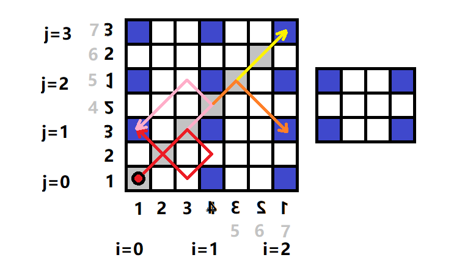

# 初赛资料与真题模拟 · 读程序写结果

[toc]

## 2018 Junior 

```C++
#include <stdio.h>
char st[100];

int main() {
	scanf("%s", st);
	for (int i = 0; st[i]; ++i) {
		if (‘A’ <= st[i] && st[i] <= ‘Z’) st[i] += 1;
	}
	printf("%s\n", st);
	return 0;
}
```

+ 输入：QuanGuoLianSai
+ 答案：RuanHuoMianTai
+ 分析：
	+ `if (‘A’ <= st[i] && st[i] <= ‘Z’) st[i] += 1;` 的作用是判断st[i]是否是大写字母，若是，则将其+1，即A变B，B变C。
	+ 以此类推。输入中的大写字母仅Q,G,L,S四个，分别向后变为R,H,M,T，其他小写字母不变。

---

```C++
#include <stdio.h>
int main() {
	int x;
    scanf("%d", &x);
    int res = 0;
    for (int i = 0; i < x; ++i) {
      	if (i * i % x == 1) {
      		++res;
      	}
    }
    printf("%d", res);
    return 0;
}
```

+ 输入：15
+ 输出：4
+ 分析：
	+ `if (i * i % x == 1) ++res;`的功能是判断 $i^2 \% x$ 是否为1.
	+ i循环从0开始，小于x，即到x-1时停止。输入的x=15，则i变化范围是0到14。
	+ 明显的，有i=1,4,11,14满足条件，故res=4

---

```C++
#include <iostream>
using namespace std;
int n, m;

int findans(int n, int m) {
    if (n == 0) return m;
    if (m == 0) return n % 3;
    return findans(n - 1, m) - findans(n, m - 1) + findans(n - 1, m - 1);
}

int main(){
    cin >> n >> m;
    cout << findans(n, m) << endl;
    return 0;
}
```

+ 输入：5 6
+ 输出：8
+ 分析：
	+ 如果出现这种较为复杂的递归调用，可用数组画图解决。
	+ 分析findans函数，两个变量n,m,因此绘制一个二维数组，第一个边界条件是当n为0时，返回m，如图第一行。
	+ 第二个边界条件是当m为0时，返回n对3的余数（0,1,2,0,1,2...)，如图第一列。
	+ 其他情况下，`f(n,m)=f(n-1,m)-f(n,m-1)+f(n-1,m-1);`即每个格子等于其上方的两个之和减去左边的。从左往右从上往下，依次计算即可。如图。


---


```C++
#include <stdio.h>
int n, d[100];
bool v[100];

int main() {
    scanf("%d", &n);
    for (int i = 0; i < n; ++i) {
        scanf("%d", d + i);
        v[i] = false;
    }
    int cnt = 0;
    for (int i = 0; i < n; ++i) {
        if (!v[i]) {
        	for (int j = i; !v[j]; j = d[j]) {
        		v[j] = true;
        	}
        	++cnt;
        }
    }
    printf("%d\n", cnt);
    return 0;
}
```

+ 输入：10 7 1 4 3 2 5 9 8 0 6
+ 输出：6
+ 分析：
	+ 开始的读入采用 `scanf("%d", d + i);` 效果与 `  scanf("%d",&d[i]);`相同。
	+ v数组一开始被赋值为false，猜测v表示visited，即**本题与图的遍历有关**。
	+ `for (int j = i; !v[j]; j = d[j])` 是一个明显的dfs遍历过程：即一直往后走，若遇到已经访问过的结点则停止。很明显，一次j循环遍历了某一个联通分量。所以cnt统计的是连通分量的个数。所以为6.（如图）

	
	
## 2018 Senior

提高组的该部分的前两题分别是普及组的第二题与第四题。

```C++
#include <iostream>
using namespace std;
string s;

long long magic(int l, int r) {
    long long ans = 0;
        for (int i = l; i <= r; ++i) {
        ans = ans * 4 + s[i] - ‘a’ + 1;
    }
return ans;
}

int main() {
    cin >> s;
    int len = s.length();
    int ans = 0;
    for (int l1 = 0; l1 < len; ++l1) {
        for (int r1 = l1; r1 < len; ++r1) {
            bool bo = true;
            for (int l2 = 0; l2 < len; ++l2) {
                for (int r2 = l2; r2 < len; ++r2) {
                    if (magic(l1, r1) == magic(l2, r2) 
                    	&& (l1 != l2 || r1 != r2)) 
                    	bo = false;
                }
            }
            
            if (bo) {
                ans += 1;
            }
        }
    }
    cout << ans << endl;
    return 0;
}
```

+ 输入：abacaba
+ 输出：16
+ 分析：
	+ magic函数中的`ans = ans * 4 + s[i] - ‘a’ + 1;`，很像秦九韶算法。（乘十加）。又因为输入的字符都是abc,猜测这是**用abcd代替1234的四进制数**。
	+ 主函数的四重循环，枚举变量分别叫l1,l2,r1,r2，又联系到magic函数的l，r，猜测这是**枚举两个不相同区间**，对应字符串就是**两个不相同的子串**。
	+ 对于一个子串[l1,r1]，若存在**另外一个子串**[l2,r2]使得**二者对应的四进制数相同**则bo=false。若不存在，则bo=true,这样ans+=1;
	+ 所以，ans统计的是在该字符串中有多少个**独特的子串**，没有重复出现过的子串。在该字符串中，字符c只出现了一次，所以包含字符c的必然是独特的，不包含c的恰好构成左右对称与中心对称，因此不包含字符c的必然是不独特的。
	+ 包含字符c的子串的左起下标位置为1~4,右起下标位置为4~7，根据乘法原理，得4 * 4=16.

---

```C++
#include <iostream>
using namespace std;
const int N = 110;
bool isUse[N];
int n, t;
int a[N], b[N];
bool isSmall() {
    for (int i = 1; i <= n; ++i)
        if (a[i] != b[i]) return a[i] < b[i];
    return false;
}
bool getPermutation(int pos) {
    if (pos > n) {
        return isSmall();
    }
    for (int i = 1; i <= n; ++i) {
        if (!isUse[i]) {
            b[pos] = i; isUse[i] = true;
            if (getPermutation(pos + 1)) {
                return true;
            }
            isUse[i] = false;
        }
    }
    return false;
}
void getNext() {
    for (int i = 1; i <= n; ++i) {
        isUse[i] = false;
    }
    getPermutation(1);
    for (int i = 1; i <= n; ++i) {
        a[i] = b[i];
    }

}
int main() {
    scanf("%d%d", &n, &t);
    for (int i = 1; i <= n; ++i) {
        scanf("%d", &a[i]);
    }
    for (int i = 1; i <= t; ++i) {
        getNext();
    }
    for (int i = 1; i <= n; ++i) {
        printf("%d", a[i]);
        if (i == n) putchar(’\n’); else putchar(’ ');
    }
    return 0;
}
```
+ 输入1：6 10 1 6 4 5 3 2
+ 输出1：2 1 3 5 6 4 
+ 输入2：6 200 1 5 3 4 2 6
+ 输出2：3 2 5 6 1 4 
+ 分析：
  + isSmall函数 ，用于判断两个数组谁大谁小。采用的方法是逐位比较。
  + getPermutation函数，用于生成一个排列。（英文原义）
  + getNext函数，用于生成下一个排列。（按从小到大顺序的下一个）
  + 因此，本题的含义是：输入一个排列，输出往后t个的排列。根据排列组合知识求解即可。

## 2017 Junior

```C++
#include<iostream>
using namespace std;
int main()
{
    int t[256];
    string s;
    int i;
    cin >> s;
    for (i = 0; i < 256; i++)
        t[i] = 0;
    for (i = 0; i < s.length(); i++)
        t[s[i]]++;
    for (i = 0; i < s.length(); i++)
        if (t[s[i]] == 1)
        {
            cout << s[i] << endl;
            return 0;
        }
    cout << "no" << endl;
    return 0;
}
```

+ 输入：xyzxyw
+ 输出：z
+ 分析
  + s[i]是字符串中下标为i的字符，一开始扫描一遍，将出现的字符数统计。
  + 如果出现只出现一次的字符，则输出，所以输出'z‘。
  + 注意，输出后直接return 0了，所以字符w虽然也只出现一次，但并没有输出。

---

```C++
#include<iostream>
using namespace std;
int g(int m, int n, int x)
{
    int ans = 0;
    int i;
    if (n == 1)
        return 1;
    for (i = x; i <= m / n; i++)
        ans += g(m - i, n - 1, i);
    return ans;
}
int main()
{
    int t, m, n;
    cin >> m >> n;
    cout << g(m, n, 0) << endl;
    return 0;
}
```

+ 输入：7 3
+ 输出：8
+ 分析：
  + 本题也是复杂的递归问题，但拥有三个参数，所以绘制数组较为困难，可以直接写出递归过程


---

```C++
#include<iostream>
using namespace std;
int main()
{
    string ch;
    int a[200];
    int b[200];
    int n, i, t, res;
    cin >> ch;
    n = ch.length();
    for (i = 0; i < 200; i++)
        b[i] = 0;
    for (i = 1; i <= n; i++)
    {
        a[i] = ch[i - 1] - '0';
        b[i] = b[i - 1] + a[i];
    }
    res = b[n];
    t = 0;
    for (i = n; i > 0; i--)
    {
        if (a[i] == 0)
            t++;
        if (b[i - 1] + t < res)
            res = b[i - 1] + t;
    }
    cout << res << endl;
    return 0;
}
```

+ 输入：1001101011001101101011110001
+ 输出：11 
+ 分析：
  + 输入以字符串形式存入数组ch[]，将其转换成数字后存入数组a[]，b[]数组为a[]数组的前缀和。 
  + 注意，又因为a数组里只有0和1，所以b数组保存的也是1的个数。
  + 变量t保存的是0的个数，`if (b[i - 1] + t < res) res = b[i - 1] + t;`，即res保存的是**前面（第1位到第i-1位）1的个数和后面（第i位到第n位）0的个数之和的最小值**.


---

```C++
#include<iostream>
using namespace std;
int main()
{
    int n, m;
    cin >> n >> m;
    int x = 1;
    int y = 1;
    int dx = 1;
    int dy = 1;
    int cnt = 0;
    while (cnt != 2)
    {
        cnt = 0;
        x = x + dx;
        y = y + dy;
        if (x == 1 || x == n)
        {
            ++cnt;
            dx = -dx;
        }
        if (y == 1 || y == m)
        {
            ++cnt;
            dy = -dy;
        }
    }
    cout << x << " " << y << endl;
    return 0;
}
```

+ 输入1：4 3
+ 输出1：1 3
+ 输入2：2017 1014
+ 输出2：2017 1 
+ 分析：
  + 出现x,y,dx,dy,猜测可能与**坐标**有关。
  + 观察：while循环的终止条件是cnt == 2。查看cnt：每次循环开始时，cnt=0。当`(x == 1 || x == n)`,`(y == 1 || y == m)`时，cnt++。而这是很明显的边界触碰判断。因此，**同时触碰两个边界后，cnt==2，while循环停止**
  + 很明显，只有当在角落时，才满足**同时触碰到两个边界**。
  + 观察dx,dy,这表示每次坐标移动的方式。当x触碰边界后，dx=-dx,也即反向，而dy不变，所以这明显的是碰撞改变方向。画图解决。
  
  

## 2017 Senior

该年提高组的第一题是普及组的第二题。第四题和普及组第四题相同，但多一问：输入为987 321时输出结果。

+ 反弹类问题可以用镜子类比：**球并没有反弹，而是穿过边界**。如图，将地图扩大化，问题转换成直线（灰色）什么是否触碰到边界块（深蓝色）。



+ 考虑边界块的坐标特征：$x=1+i(n-1),y=1+j(m-1)$,灰色块的坐标特征：$x=y$，联立得到：

$$
1+i(n-1) = 1+j(m-1) \rightarrow i(n-1) = j(m-1)
$$

带入$$n=987,m=321$$有 $ 986i = 320j$ 即 $493i = 160j$ 而 493与160互质，所以满足条件的最小的i和j分别是$i=160,j=493$

观察图，得知，当i为偶数时，对应的是原来坐标的x=1，i为奇数，对应的是坐标x=n.
当j为偶数时，对应的是原来坐标的y=1，j为奇数，对应的是坐标y=m.

现在求出i=160,j=493,得原先的坐标是(1,m),即（1,321）

---

```C++

#include <iostream>
using namespace std;
int main() {
    int n, i, j, x, y, nx, ny;
    int a[40][40];
    for (i = 0; i < 40; i++)
        for (j = 0; j < 40; j++)
            a[i][j] = 0;
    cin >> n;
    y = 0;
    x = n - 1;
    n = 2 * n - 1;
    for (i = 1; i <= n * n; i++) {
        a[y][x] = i;
        ny = (y - 1 + n) % n;
        nx = (x + 1) % n;
        if ((y == 0 && x == n - 1) || a[ny][nx] != 0)
            y = y + 1;
        else {
            y = ny; x = nx;
        }
    }
    for (j = 0; j < n; j++)
        cout << a[0][j] << " ";
    cout << endl;
    return 0;
}
```

+ 输入：3
+ 输出：17 24 1 8 15 
+ 分析
  + for循环从i开始到$ (2n-1)^2$，明显是一个矩阵。猜测可能是各种类型的矩阵填数。
  + 由`a[y][x]=i`得知，y表示行，x表示列。由开始y=0,x=n-1知，矩阵从最上面一行的正中间开始填数。
  + `ny = (y - 1 + n) % n; nx = (x + 1) % n;`明显的，这是在往**右上方**填数。且遇到边界循环，这是明显的**幻方填数**，即填完后每行每列的和为相同值。
  + 因此，答案是5 * 5的幻方矩阵的第一行。


---

```C++
#include <iostream>
using namespace std;
int n, s, a[100005], t[100005], i;
void mergesort(int l, int r)
{
    if (l == r)
        return;
    int mid = (l + r) / 2;
    int p = l;
    int i = l;
    int j = mid + 1;
    mergesort(l, mid);
    mergesort(mid + 1, r);
    while (i <= mid && j <= r)
    {
        if (a[j] < a[i])
        {
            s += mid - i + 1;
            t[p] = a[j];
            p++;
            j++;
        }
        else
        {
            t[p] = a[i];
            p++;
            i++;
        }
    }
    while (i <= mid)
    {
        t[p] = a[i];
        p++;
        i++;
    }
    while (j <= r)
    {
        t[p] = a[j];
        p++;
        j++;
    }
    for (i = l; i <= r; i++)
        a[i] = t[i];
}
int main()
{
    cin >> n;
    for (i = 1; i <= n; i++)
        cin >> a[i];
    mergesort(1, n);
    cout << s << endl;
    return 0;
}
```

+ 输入：6 2 6 3 4 5 1
+ 输出：8
+ 分析：
  + Mergesort，明显的是归并排序，最后输出答案s，在合并中有`s += mid - i + 1`
  + 模拟该过程即可。

## 2016 Junior

```C++
#include <iostream>
using namespace std;
int main()
{
    int max, min, sum, count = 0;
    int tmp;
    cin >> tmp;
    if (tmp == 0)
        return 0;
    max = min = sum = tmp;
    count++;
    while (tmp != 0)
    {
        cin >> tmp;
        if (tmp != 0)
        {
            sum += tmp;
            count++;
            if (tmp > max)
                max = tmp;
            if (tmp < min)
                min = tmp;
        }
    }
    cout << max << "," << min << "," << sum / count << endl;
    return 0;
}
```

+ 输入：1 2 3 4 5 6 0 7
+ 输出：6,1,3 
+ 分析：
  + 变量名很明确，输出最大值、最小值、和除以计数（平均值）。
  + 注意，while循环的终止条件是tmp==0，因此当读入读取到tmp==0时，后面的7并未读入，也并未参与计算。0本身也没有参与计算。因此答案是1到6的最大值，最小值，平均值。
  + 注意，输出的平均值是整数除整数，因此是下取整，且有逗号分隔。

---

```C++
#include <iostream>
using namespace std;

int main()
{
	int i = 100, x = 0, y = 0;
	while (i > 0)
	{
		i--;
		x = i % 8;
		if (x == 1)
			y++;
	}
	cout << y << endl;
	return 0;
}
```

+ 输入：无
+ 输出：13 
+ 分析：
  + while循环的停止条件是i=0；每次令x=i%8，若对8取模为1，则输出值y++；
  + 注意，参与计算的i从99开始，到0结束。因为是先i--后再参与计算。
  + 因此，y的值为0到99内对8取余为1的数字的个数。为13个。

---


```C++
#include <iostream>
using namespace std;

int main(){
	int a[6] = {1, 2, 3, 4, 5, 6};
	int pi = 0;
	int pj = 5;
	int t, i;
	while (pi < pj)
	{
		t = a[pi];
		a[pi] = a[pj];
		a[pj] = t;
		pi++;
		pj--;
	}
	for (i = 0; i < 6; i++)
		cout << a[i] << ",";
	cout << endl;
	return 0;
}
```

+ 输入：无
+ 输出：6,5,4,3,2,1,
+ 分析：
  + pi与pj分别对应两个下标，将二者指向的数字交换，直到二者相遇。
  + 那么，必然是0-5,1-4,2-3，当变为3-2时，while循环停止。这等价与数组逆向。
  + 注意，最后一个数字的末尾还有一个逗号。

---

```C++
#include <iostream>
using namespace std;
int main()
{
	int i, length1, length2;
	string s1, s2;
	s1 = "I have a dream.";
	s2 = "I Have A Dream.";
	length1 = s1.size();
	length2 = s2.size();
	for (i = 0; i < length1; i++)
		if (s1[i] >= 'a' && s1[i] <= 'z')
			s1[i] -= 'a' - 'A';
	for (i = 0; i < length2; i++)
		if (s2[i] >= 'a' && s2[i] <= 'z')
			s2[i] -= 'a' - 'A';
	if (s1 == s2)
		cout << "=" << endl;
	else if (s1 > s2)
		cout << ">" << endl;
	else
		cout << "<" << endl;
	return 0;
}
```

+ 输入：无
+ 输出：=
+ 分析：
  + 两个for循环将串的小写字母改成大写字母。即`"I HAVE A DREAM."`
  + s1串与s2串更改后是完全一样的，故输出等于号。


## 2016 Senior

该年提高组的第一题是普及组的第三题。

```C++
#include <iostream> 
using namespace std;
int main()
{
    char a[100][100], b[100][100];
    string c[100];
    string tmp;
    int n, i = 0, j = 0, k = 0, total_len[100], length[100][3];
    cin >> n;
    getline(cin, tmp);
    for (i = 0; i < n; i++)
    {
        getline(cin, c[i]);
        total_len[i] = c[i].size();
    }
    for (i = 0; i < n; i++)
    {
        j = 0;
        while (c[i][j] != ':')
        {
            a[i][k] = c[i][j];
            k = k + 1;
            j++;
        }
        length[i][1] = k - 1;
        a[i][k] = 0;
        k = 0;
        for (j = j + 1; j < total_len[i]; j++)
        {
            b[i][k] = c[i][j];
            k = k + 1;
        }
        length[i][2] = k - 1;
        b[i][k] = 0;
        k = 0;
    }
    for (i = 0; i < n; i++)
    {
        if (length[i][1] >= length[i][2])
            cout << "NO,";
        else
        {
            k = 0;
            for (j = 0; j < length[i][2]; j++)
            {
                if (a[i][k] == b[i][j])
                    k = k + 1;
                if (k > length[i][1])
                    break;
            }
            if (j == length[i][2])
                cout << "NO,";
            else
                cout << "YES,";
        }
    }
    cout << endl;
    return 0;
}
```

+ 输入：
3
AB:ACDEbFBkBD
AR:ACDBrT
SARS:Severe Atypical Respiratory Syndrome
+ 输出：YES,NO,YES, 
+ 分析：
  + 输入的多行字符串保存进入c数组。
  + `while (c[i][j] != ':')`，说明遇到分号时停止，循环体所做的是将c数组内容拷贝到a数组里，因此：**a数组保存的是冒号左边部分**
  + 紧接着for循环是将c数组的剩余内容拷贝进b数组，因此**b数组保存的是冒号的右半部分**
  + 下方的for-i循环控制输出。当冒号左边长度大于右边长度时，直接输出`NO，`
  + 当左侧长度小于右侧时，内部的for-j循环作用是判断**左侧是否是右侧的子序列**。是则为`Yes,`,否则为`No,`
  + 明显的，该程序功能里是**判断冒号左侧是否是右侧词组的缩写**


---

```C++
#include <iostream>
using namespace std;
int lps(string seq, int i, int j)
{
    int len1, len2;
    if (i == j)
        return 1;
    if (i > j)
        return 0;
    if (seq[i] == seq[j])
        return lps(seq, i + 1, j - 1) + 2;
    len1 = lps(seq, i, j - 1);
    len2 = lps(seq, i + 1, j);
    if (len1 > len2)
        return len1;
    return len2;
}
int main()
{
    string seq = "acmerandacm";
    int n = seq.size();
    cout << lps(seq, 0, n - 1) << endl;
    return 0;
}
```

+ 输入：无
+ 输出：5
+ 分析：
  + 主函数内给定0，n-1，很明显表示的区间的左右端点。而seq一直没变，所以主要参数在于i,j.
  + `if (seq[i] == seq[j]) return lps(seq, i + 1, j - 1) + 2;` 当前区间的首位字母相同，则答案要+2.`if (i == j) return 1;` 当区间长度为1时返回1，这说明该函数是在求取**满足某个条件的字符个数**
  + 若首位字母不同，则`len1 = lps(seq, i, j - 1); len2 = lps(seq, i + 1, j);`返回值是在这二者取较大值。
  + 综上，这很明显是在求**最大回文子序列的长度**。因此答案显而易见。


---


```C++
#include <iostream>
#include <cstring>
using namespace std;
int map[100][100];
int sum[100], weight[100];
int visit[100];
int n;
void dfs(int node)
{
    visit[node] = 1;
    sum[node] = 1;
    int v, maxw = 0;
    for (v = 1; v <= n; v++)
    {
        if (!map[node][v] || visit[v])
            continue;
        dfs(v);
        sum[node] += sum[v];
        if (sum[v] > maxw)
            maxw = sum[v];
    }
    if (n - sum[node] > maxw)
        maxw = n - sum[node];
    weight[node] = maxw;
}
int main()
{
    memset(map, 0, sizeof(map));
    memset(sum, 0, sizeof(sum));
    memset(weight, 0, sizeof(weight));
    memset(visit, 0, sizeof(visit));
    cin >> n;
    int i, x, y;
    for (i = 1; i < n; i++)
    {
        cin >> x >> y;
        map[x][y] = 1;
        map[y][x] = 1;
    }
    dfs(1);
    int ans = n, ansN = 0;
    for (i = 1; i <= n; i++)
        if (weight[i] < ans)
        {
            ans = weight[i];
            ansN = i;
        }
    cout << ansN << " " << ans << endl;
    return 0;
}
```

+ 输入：
11
1 2
1 3
2 4
2 5
2 6
3 7
7 8
7 11
6 9
9 10
+ 输出： 2 5 
+ 分析：
  + 出现了map,sum,visit,dfs等单词，说明这是一个图上深度优先遍历的问题。
  + 由`map[x][y]=map[y][x]=1`说明这是无向图。


  + 发现，图构成一棵树。在dfs过程中，sum数组记录了某个值，其中，对于叶子节点为1，对于非叶子节点，为其各子树的结点的sum之和+1，这很明显是**在当前dfs树下，以当前节点为根结点的子树的结点个数**
  + maxw记录的是当前节点的子树中最多结点数。保存在weight数组，因此，对于dfs(1)，很明显是编号为2的结点最**重**，重量为5.